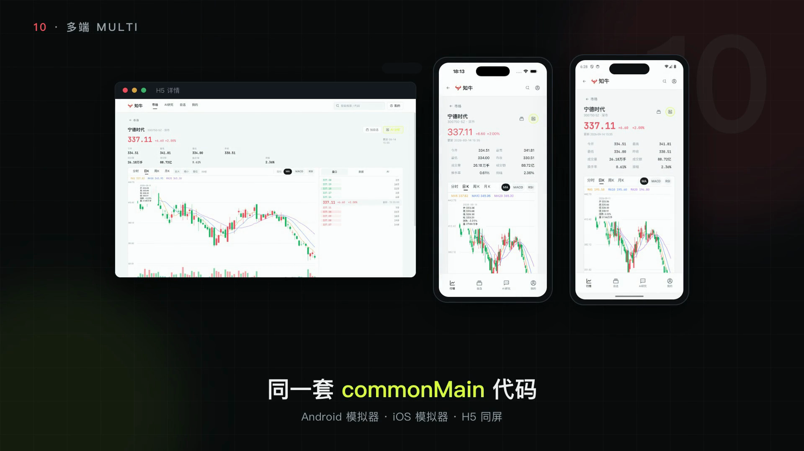
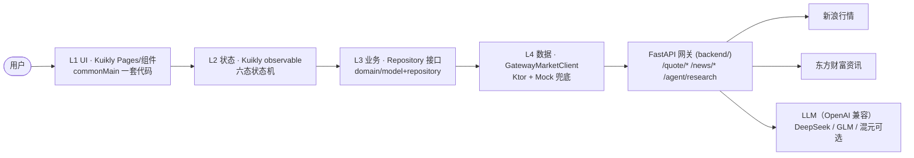

<div align="center">


# 知牛 · ZhiNiu

**从问一句，到看懂一只股票。** 基于 [Kuikly](https://github.com/Tencent-TDS/KuiklyUI) 的 AI 股票多端应用——一套 `commonMain` 代码，跑通 **H5 / Android / iOS / 鸿蒙**：看行情、问 AI、让 AI 直接帮你操作。

[](https://kotlinlang.org)
[](https://github.com/Tencent-TDS/KuiklyUI)
[](backend)
[](https://github.com/HongMing-Huang/zhiniu-demo/actions/workflows/ci.yml)
[](LICENSE)

---

### 📺 演示视频（1 分 20 秒 · 三端真实运行）

> 素材均来自真实运行的 **H5 + iOS 模拟器 + Android 模拟器**，三端价格一致（同一套 `commonMain` 代码）。

<video src="docs/video/demo.mp4" controls="controls" width="100%" poster="docs/img/pages_preview.png" preload="metadata"></video>

**三端同屏**：同一只股票（宁德时代 · 337.11）在 H5 / iOS / Android 三端同时渲染，价格与 K 线完全一致。



</div>

---

## 先看演示

| 方式 | 链接 / 命令 | 说明 |
|:--|:--|:--|
| **Android 直接安装** | [zhiniu-debug.apk](zhiniu-debug.apk)（约 8 MB） | 下载即装；默认连 `10.0.2.2:8000`（模拟器）/ 本机网关，见 [运行说明](docs/getting-started.md) |
| **H5 秒开** | 起后端 + `python3 -m http.server 8082`（web-host 目录） | 浏览器打开即为 390 移动布局 |
| **iOS / 鸿蒙** | 见 [docs/getting-started.md](docs/getting-started.md) | iOS 需 Xcode Run；鸿蒙需 DevEco 构建 HAP |

> 行情来自公开免费接口（新浪/东财），AI 结论由大模型生成，两者都可能出错；本作品仅用于课程学习与产品原型演示，**不构成任何投资建议**，也不提供真实证券交易。

## 这是什么

知牛（ZhiNiu）是一个基于 [KuiklyUI](https://github.com/Tencent-TDS/KuiklyUI)（腾讯开源 KMP 跨端框架）的 AI 股票应用，对应课题 **Task 1 · AI 股票行情原型** 与 **Task 2 · AI 股票问答应用**：

- **看行情（Task 1）**：市场列表（自选 / 排序 / 筛选 / 搜索 / 人气榜）→ 个股详情（五档盘口、日K/分时缩放、十字线、MA/MACD/RSI、资金/财务/新闻、加自选），行情为**真实新浪财经数据**
- **问 AI（Task 2）**：多 Agent 研究会话（分析 / 多空对抗 / 风控三视角），回复用 **Markdown + 结构化证据卡**混排渲染，来源可追溯，点击卡片跳回个股详情形成闭环
- **一套代码**：业务代码 100% 位于 `commonMain`，H5 / Android / iOS / 鸿蒙四端壳就绪；页面流转、状态机、主题切换跨端一致

> 命名寓意：「知牛」双关「知道牛股 / 识得牛熊」。

## 任务对照

| 任务 | 实际路径 | 验收要点 |
|:--|:--|:--|
| **Task 1 · 行情原型** | 市场列表（自选/筛选/排序/人气榜/板块）→ 搜索 → 个股详情（日K/分时缩放/十字线/MA/MACD/RSI/五档/资金/财务/新闻）→ 加自选 → 价格预警 | 真实新浪+东财数据；断网自动回退快照并标记 stale |
| **Task 2 · AI 问答** | AI 研究页提问 → 多 Agent 管线（四阶段进度）→ Markdown+证据卡混排 → 结论徽章/K线卡 → 点击卡片回详情 → 追问/对比/停止/重试 → 会话归档 | 真 LLM 流式逐字上屏；LLM 不可用明示「规则降级」；AI 可执行 6 类工具指令直接操作 App |

逐项自查详见 [docs/deliverables.md](docs/deliverables.md)。

## 核心亮点

- **真实行情**：新浪实时报价 + 日K/分时 + 东方财富资讯，经 FastAPI 网关统一归一化（含来源、TTL、stale 标记），断网自动回退本地快照
- **多 Agent 研究**：行情 → 技术面 → 财务 → 资讯 → 风险 → 多空辩论 → 研究经理 → 交易员 → 风控 → 归纳，四阶段进度实时可见；对同一标的的结论、依据、来源逐段可追溯
- **AI Agent 工具指令**：对知牛说「把比亚迪加到自选」「宁德时代跌破 300 提醒我」「对比茅台和宁德」「换成深色」——模型按 ⟦TOOL⟧ 协议输出 6 类指令（加自选 / 双股对比 / 价格预警 / 转入研究 / 切外观 / 切涨跌配色），名称→代码经东财搜索**真实解析（拒绝编造）**，客户端执行并回执反馈卡
- **结构化 AI 渲染**：Markdown（标题/列表/表格/代码块）与结构化卡片（股票卡 / 关键指标 / 买卖观察区间 / 风险分级五档 / 迷你走势）混排，自研解析器纯函数实现并带单测
- **诚实降级**：LLM 不可用时输出规则引擎结论并标注「规则降级 · 未伪装模型」；行情断网保留最近快照并打 stale 标记——从不伪装
- **防幻觉协议**：证券代码必须来自本轮搜索工具；行情/财报/K 线数值由服务端回填卡片，模型不得填写或修改数字；工具失败明示失败项
- **体验细节**：Light/Dark/System 180ms 切换、完整状态机（Idle/Loading/Success/Empty/Error/Stale）、等宽数字、安全区避让、无障碍语义
- **离线可跑**：内置确定性 Mock，断网 / 无 Key 均可完整演示

## 快速开始

环境要求：JDK 17、Python 3.10+（H5 演示零 Android 依赖）。

```bash
git clone https://github.com/HongMing-Huang/zhiniu-demo.git
cd zhiniu-demo

# 1) 后端网关（真实行情 / 资讯 / AI；不启动则前端走本地快照）
cd backend
python3 -m venv .venv && source .venv/bin/activate
pip install -r requirements.txt
cp .env.example .env      # 可选：填 LLM Key，缺 Key 时自动「规则降级」
uvicorn app.main:app --port 8000 &
cd ..

# 2) 前端 H5（构建 + 部署 + 起服务）
./scripts/build.sh
cd web-host && python3 -m http.server 8082 --bind 127.0.0.1
# 打开 http://127.0.0.1:8082/index.html?page_name=MarketList&use_spa=1
```

Android / iOS / 鸿蒙壳运行方式见 [docs/getting-started.md](docs/getting-started.md)。

### 部署上线（可选）

- **后端**：Render → New → Blueprint（识别仓库根 `render.yaml`），填入 `DATABASE_URL`（Neon 连接串，可选）与 LLM Key 即可；也可用任意 PaaS 以 `uvicorn app.main:app --host 0.0.0.0 --port $PORT` 启动。
- **H5 前端**：`web-host/` 为纯静态目录，可直接托管到 Vercel / Netlify / gh-pages；线上访问后端用 `?gateway=https://你的网关域名` 覆盖默认地址。
- **数据库**：设置 `DATABASE_URL` 即启用 Postgres（Neon）持久化——研究结果跨进程缓存 + request_id 幂等；未设置时自动降级纯内存，功能不受影响。

## 多端支持

| 平台 | 状态 | 说明 |
|:--|:--:|:--|
| Web (H5) | ✅ 主演示端 | 官方渲染宿主 + SPA 路由，四分辨率 + 深浅色验收通过 |
| Android | ✅ 模拟器实测 | API34 模拟器端到端验收：真实行情渲染 + gateway 参数联调宿主机网关 + 离线快照降级验证；`assembleDebug` 产出 APK 已入库 |
| iOS | ✅ 模拟器实测 | iPhone 17 Pro 模拟器 install+launch 验收：指数/行情/导航与 H5/Android 数据一致 |
| HarmonyOS | 🔶 桥接完成 | 网络层 `GatewayTransport` expect/actual 桥接落地（commonMain 去 Ktor，ohosArm64 编译通过），libshared.so/.h 已产出回填；剩 DevEco 内 hvigor 构建（无 DevEco 环境，方案见 `docs/platform-readiness.md`） |
| 小程序 / macOS | — | Kuikly 具备能力，本课题未投入验证，不做承诺 |

## 架构



- 前端：Kuikly DSL（`@Page` / `observable` / `vfor` / Canvas），Ktor Client，kotlinx.serialization；无 DI 框架、页面级直接访问（见 ADR）
- 后端：Python FastAPI 数据与 LLM 网关，密钥只在服务端，OpenAI 兼容协议统一多模型
- 完整决策记录：[docs/architecture.md](docs/architecture.md)

## 后端接口概览

| 能力 | 接口 |
|:--|:--|
| 健康检查 | `GET /healthz` |
| 实时行情（多代码批量） | `GET /quote/realtime?codes=sh600519,sz000001` |
| 日 K / 分时 | `GET /quote/kline?symbol=&scale=&datalen=` |
| 个股资讯 | `GET /news/list?symbol=` |
| 人气榜（东财真实排名） | `GET /quote/popularity?count=20` |
| 行业板块 / 选股 | `GET /quote/sectors` · `GET /quote/screener` |
| 全市场搜索（东财 suggest） | `GET /quote/search?keyword=&count=` |
| 估值与财报 | `GET /quote/fundamentals?symbol=` |
| 多 Agent 研究（JSON / SSE） | `POST /agent/research` · `POST /agent/research/stream` |
| 个股 AI 诊股（缓存+去重） | `POST /agent/insight` |
| 通用问答（同步 / 流式） | `POST /agent/chat` · `POST /agent/chat/stream` |
| 双股 AI 对比（同步 / 流式） | `POST /agent/compare` · `POST /agent/compare/stream` |
| OpenAI 兼容对话 | `POST /v1/chat/completions` |

## 项目结构

```
zhiniu-demo/
├── kuikly-shell/                    # Kuikly 工程（前端）
│   ├── shared/src/commonMain/       # 全部业务代码（跨端共享）
│   │   └── kotlin/com/zhiniu/
│   │       ├── pages/               # MarketPage / StockDetailPage / AiResearchPage + AppBasePage
│   │       │   └── components/      # common/market/chart/ai 组件库 + Theme/Format/Icons + Markdown
│   │       ├── domain/              # model / repository（接口）
│   │       ├── data/                # remote 网关客户端 / mock 确定性快照 / local
│   │       ├── base/                # BasePager / PageNavigator / BridgeModule
│   │       └── platform/            # expect/actual（主题、HttpClient）
│   ├── androidApp/ iosApp/ ohosApp/ # 三端官方壳（适配器齐全）
│   └── shared/src/commonTest/       # 纯逻辑单测（Markdown/SSE/K线/错误模型）
├── backend/                         # FastAPI 数据与 LLM 网关（含 53 项单测）
├── web-host/                        # H5 官方渲染宿主（同源单端口入口）
├── scripts/                         # build.sh（构建+部署） / icons_build.sh
└── docs/                            # 架构 / 技术栈 / 字体 / API 矩阵 / 交付对照
```

## 文档

- [快速开始（各端）](docs/getting-started.md)
- [架构说明（C4 + ADR）](docs/architecture.md)
- [技术栈定稿](docs/tech-stack.md)
- [字体规范（官方字体接入）](docs/typography.md)
- [交付物与评分自查](docs/deliverables.md)
- [外部 API 接入与降级链](docs/api-matrix.md)
- [LLM 网关设计](docs/backend-llm-gateway-design.md)
- [课题组对标调研](docs/sairen-benchmark.md)
- [已知问题与风险清单](docs/known-issues.md)
- [变更日志](docs/WORKLOG.md)

## 致谢与参考

- [Tencent-TDS/KuiklyUI](https://github.com/Tencent-TDS/KuiklyUI) — 跨端框架底座（壳工程、字体/路由/图片适配器均沿用官方接入方式）
- [Tencent/tdesign-icons](https://github.com/Tencent/tdesign-icons) — 全部图标资源（MIT，本地 PNG 预着色）
- [TauricResearch/TradingAgents](https://github.com/TauricResearch/TradingAgents) — 多 Agent 角色分工与多空辩论心智（仅借鉴公开架构）
- [JetBrains/JetBrainsMono](https://github.com/JetBrains/JetBrainsMono) — 数字等宽字体（SIL OFL 1.1）

## License

MIT（字体与图标资源按其各自开源许可分发，见 `docs/fonts/` 与 `scripts/icons_build.sh`）。

---

> ⚠️ 免责声明：本项目仅供技术学习与 Kuikly 框架演示，不构成任何投资建议。股市有风险，投资需谨慎。
