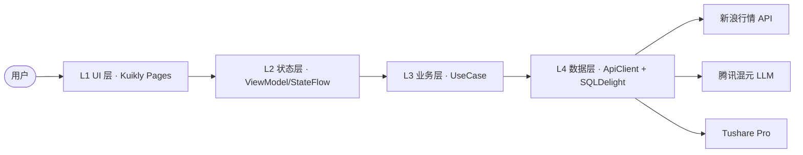

<div align="center">


# 知牛 · ZhiNiu

**基于 Kuikly 的 AI 股票多端 Demo —— 一套 Kotlin 代码，六端原生运行，AI 帮你看懂行情、识别牛熊**

[](LICENSE)
[](https://kotlinlang.org)
[](https://github.com/Tencent-TDS/KuiklyUI)
[](#多端支持)
[](https://github.com/〔你的用户名〕/zhiniu/stargazers)


</div>

---

## 这是什么

知牛（ZhiNiu）是一个基于 [Kuikly](https://github.com/Tencent-TDS/KuiklyUI)（腾讯开源 KMP 跨端框架）的 AI 股票应用 Demo：

- **看行情**：实时行情列表 + 个股详情（OHLC / 五档 / K 线），数据来自真实的新浪财经 API
- **问 AI**：多 Agent 编排的股票问答，腾讯混元大模型驱动，支持流式输出与结构化卡片
- **一套代码**：90%+ 代码在 commonMain 共享，Android / iOS / 鸿蒙 / Web / 小程序多端原生渲染

> 命名寓意：「知牛」双关「知道牛股 / 识得牛熊」。

## 特性

| 特性 | 说明 |
|:---|:---|
| 实时行情 | 新浪 `hq.sinajs.cn` 真实数据，A 股 / 港股 / 美股 / 指数 |
| AI 一键诊股 | 多 Agent（基本面 / 技术面 / 舆情 / 风控）并行分析，4 张结构化卡片输出 |
| AI 多空辩论 | 「换个角度看」多 / 空双视角气泡轮播，分歧点高亮 |
| 流式问答 | 混元 LLM SSE 流式输出，Markdown + 5 种结构化卡片混排 |
| 图表联动 | Vico 蜡烛图 K 线，信号标记与摘要卡锚点联动 |
| 完整状态机 | Idle / Loading 骨架屏 / Success / Empty / Error 重试 / Stale 六态全覆盖 |
| 多端原生 | Kuikly 原生渲染，无 JS 桥接，鸿蒙正式支持 |
| 离线可跑 | 内置 Mock 数据，断网 / 无 Token 均可演示 |

## 架构



完整架构文档（C4 三层 + ADR）：[docs/architecture.md](docs/architecture.md)

## 快速开始

```bash
# 1. 克隆
git clone https://github.com/〔你的用户名〕/zhiniu.git
cd zhiniu

# 2. 配置环境变量（可选，不配则走 Mock 数据）
cp .env.example .env
# 编辑 .env 填入 HUNYUAN_SECRET_KEY / TUSHARE_TOKEN

# 3. 运行 Android
./gradlew :androidApp:installDebug
```

> 环境要求：JDK 17、Android Studio ≥ 2024.2.1、Kotlin 2.0+。
> iOS / 鸿蒙 / Web 端运行方式见 [docs/getting-started.md](docs/getting-started.md)。

## 多端支持

| 平台 | 运行方式 | 状态 |
|:---|:---|:---:|
| Android | `./gradlew :androidApp:installDebug` | ✅ |
| iOS | `pod install` + Xcode | ✅ |
| HarmonyOS | DevEco Studio 5.1+ | ✅ |
| Web (H5) | `./gradlew :h5App:run` | 🔶 Beta |
| 微信小程序 | 微信开发者工具 | 🔶 Beta |
| macOS | 复用 iOS 渲染层 | ⭐ Alpha |

## 项目结构

```
zhiniu/
├── shared/src/commonMain/kotlin/com/zhiniu/
│   ├── pages/           # 页面（行情 / 详情 / 聊天）+ components 组件库
│   ├── viewmodel/       # ViewModel（StateFlow 四态）
│   ├── domain/          # model / usecase / repository
│   └── data/            # remote / local / mock
├── androidApp/  iosApp/  ohosApp/  h5App/
└── docs/                # 架构文档 / 演示脚本 / 截图
```

## 文档

- [开发问题汇总（待决策 ⚠️）](DEVELOPMENT-ISSUES.md)
- [技术栈定稿](docs/tech-stack.md)
- [AI 设计指导（Light Theme 唯一权威）](docs/ai-design-guide.md)
- [UI 界面设计](docs/ui-design.md)
- [技术方案全文](docs/zhiniu-technical-design.md)
- [LLM 多模型网关后端设计](docs/backend-llm-gateway-design.md)
- [多 LLM 统一路由管理设计（Cherry Studio 借鉴）](docs/llm-router-design.md)
- [Kuikly 公共组件与图标公共资源选型](docs/kuikly-common-assets.md)
- [架构说明（C4 + ADR）](docs/architecture.md)
- [API 接入与降级链](docs/api-matrix.md)
- [快速开始](docs/getting-started.md)
- [演示视频脚本](docs/demo-script.md)

## 致谢与参考

本项目站在以下优秀开源项目的肩膀上（详见技术方案 §2 调研）：

- [Tencent-TDS/KuiklyUI](https://github.com/Tencent-TDS/KuiklyUI) — 跨端框架底座
- [ZhuLinsen/daily_stock_analysis](https://github.com/ZhuLinsen/daily_stock_analysis) — 多数据源 fallback 与决策仪表盘字段设计参考
- [TauricResearch/TradingAgents](https://github.com/TauricResearch/TradingAgents) — 多 Agent 角色分工与多空辩论心智
- [virattt/ai-hedge-fund](https://github.com/virattt/ai-hedge-fund) — Agent 可视化工作流参考
- [patrykandpatrick/vico](https://github.com/patrykandpatrick/vico) — K 线图表库

## 贡献

Issues 和 PR 欢迎！参见 [CONTRIBUTING.md](CONTRIBUTING.md)。

## License

MIT © 〔你的名字 / 团队〕

---

> ⚠️ 免责声明：本项目仅供技术学习与 Kuikly 框架演示，不构成任何投资建议。股市有风险，投资需谨慎。
