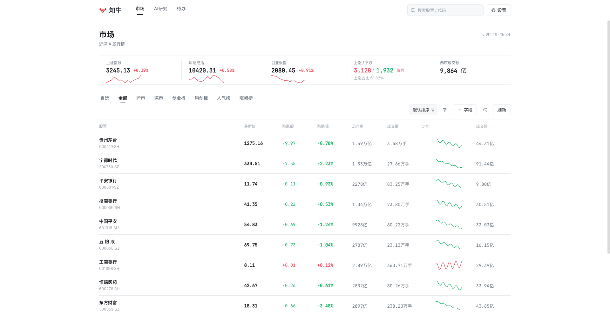
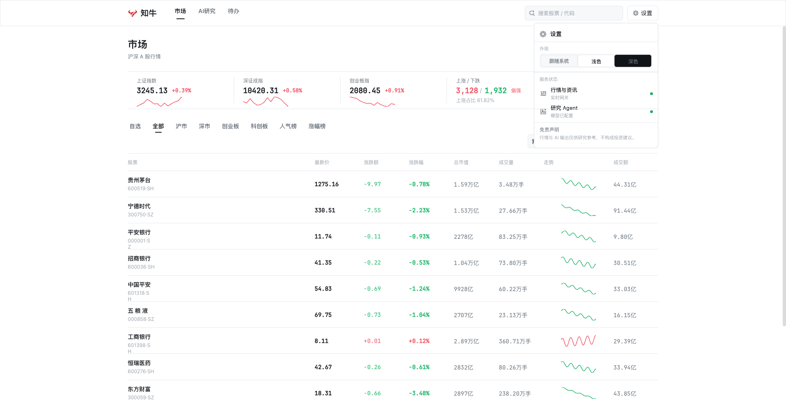
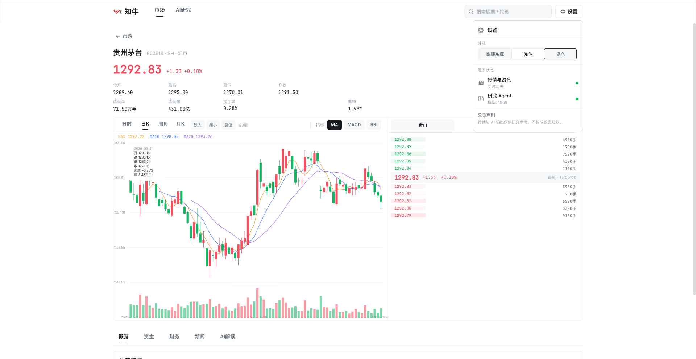
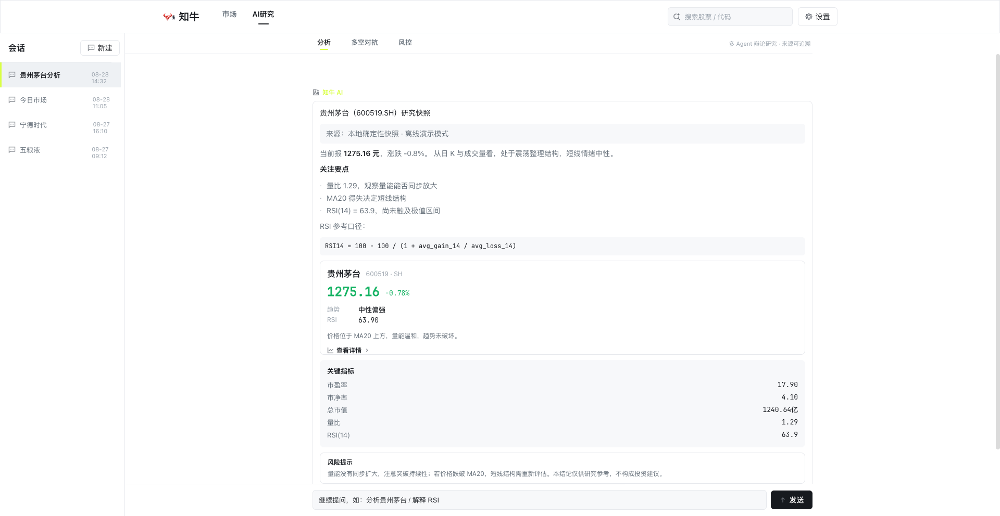

<div align="center">

# 知牛 · ZhiNiu

**基于 Kuikly 的 AI 股票多端应用 —— 一套 Kotlin 代码，AI 帮你看懂行情、识别牛熊**

[](https://kotlinlang.org)
[](https://github.com/Tencent-TDS/KuiklyUI)
[](backend)
[](LICENSE)

| 行情 · Light | 行情 · Dark | 个股详情 | AI 研究归纳 |
|:---:|:---:|:---:|:---:|
|  |  |  |  |

</div>

---

## 这是什么

知牛（ZhiNiu）是一个基于 [KuiklyUI](https://github.com/Tencent-TDS/KuiklyUI)（腾讯开源 KMP 跨端框架）的 AI 股票应用，对应课题 **Task 1 · AI 股票行情原型** 与 **Task 2 · AI 股票问答应用**：

- **看行情（Task 1）**：首页行情列表（自选 / 排序 / 筛选 / 搜索 / 人气榜）→ 个股详情（五档盘口、日K/分时缩放、十字线、MA/MACD/RSI、资金/财务/新闻 Tab、加自选），行情为**真实新浪财经数据**
- **问 AI（Task 2）**：多 Agent 研究会话（分析 / 多空对抗 / 风控三视角），回复用 **Markdown（标题 / 列表 / 表格 / 代码块）+ 结构化证据卡混排**渲染，来源可追溯，点击卡片跳回个股详情形成闭环
- **一套代码**：业务代码 100% 位于 `commonMain`，H5 / Android / iOS / 鸿蒙四端壳就绪；页面流转、状态机、主题切换跨端一致

> 命名寓意：「知牛」双关「知道牛股 / 识得牛熊」。

## 特性

| 特性 | 说明 |
|:---|:---|
| 真实行情 | 新浪 `hq.sinajs.cn` 实时报价 + 日K/分时 + 东方财富个股资讯，经 FastAPI 网关统一归一化（含来源、TTL、stale 标记），断网自动回退本地快照 |
| 多 Agent 研究 | 行情 → 技术面 → 财务 → 资讯 → 风险 → 多头 → 空头 → 研究经理 → 交易员 → 风控 → 归纳，四阶段进度实时可见；已接入真实 LLM（OpenAI 兼容多厂商网关，GemAI/DeepSeek 实测跑通），LLM 不可用时明确标记「规则降级 · 未伪装模型」 |
| Markdown 渲染 | 自研 commonMain Markdown 解析器（标题/列表/表格/代码块/引用/行内加粗），`RichText+Span` 官方组件渲染，commonTest 单测覆盖 |
| AI 诊股抽屉 | 个股页一键 AI 分析：基本面 / 技术面（MA·RSI·MACD）/ 情绪 / 风险四维结构化输出 |
| 图表交互 | Kuikly Canvas 自绘蜡烛图 / 量柱 / MACD / RSI，按钮 + 滚轮 + 拖拽 + 捏合缩放，十字线 OHLCV 联动 |
| 完整状态机 | Idle / Loading 骨架 / Success / Empty / Error 重试 / Stale 六态覆盖 |
| Light/Dark/System | 语义色 token + 动态调色板代理，180ms 平滑切换，H5/原生一致 |
| 官方字体接入 | 数字等宽 JetBrains Mono（OFL），按 KuiklyUI 官方机制三端注册（见 [docs/typography.md](docs/typography.md)） |
| 跨端待办基线 | 待办清单页（新增/编辑/删除/完成/清除已完成），持久化走 Kuikly 官方 `SharedPreferencesModule` 三端落地；一套 commonMain 代码，Android APK 构建 + iOS Kotlin 编译 + H5 实测三端验证 |
| 离线可跑 | 内置确定性 Mock，断网 / 无 Key 均可完整演示 |

## 架构


- 前端：Kuikly DSL（`@Page` / `observable` / `vfor` / Canvas），Ktor Client，kotlinx.serialization；无 DI 框架、页面级直接访问（见 ADR）
- 后端：Python FastAPI 数据与 LLM 网关，密钥只在服务端，OpenAI 兼容协议统一多模型
- 完整决策记录：[docs/architecture.md](docs/architecture.md)

## 快速开始

环境要求：JDK 17、Python 3.10+（H5 演示零 Android 依赖）。

```bash
git clone https://github.com/HongMing-Huang/zhiniu-demo.git
cd zhiniu-demo

# 1) 后端网关（真实行情 / 资讯 / AI；不启动则前端走本地快照）
cd backend
python3 -m venv .venv && source .venv/bin/activate
pip install -r requirements.txt
cp .env.example .env      # 可选：填 LLM Key，缺 Key 时自动「规则降级」
uvicorn app.main:app --port 8000 &
cd ..

# 2) 前端 H5（构建 + 部署 + 起服务）
./scripts/build.sh
cd web-host && python3 -m http.server 8082 --bind 127.0.0.1
# 打开 http://127.0.0.1:8082/index.html?page_name=MarketList&use_spa=1
```

Android / iOS / 鸿蒙壳运行方式见 [docs/getting-started.md](docs/getting-started.md)。

## 多端支持

| 平台 | 状态 | 说明 |
|:--|:--:|:--|
| Web (H5) | ✅ 主演示端 | 官方渲染宿主 + SPA 路由，四分辨率 + 深浅色验收通过 |
| Android | ✅ 构建通过 | `:androidApp:assembleDebug` 产出 androidApp-debug.apk（官方 KRView 壳 + 全套适配器）；真机联调见快速开始 |
| iOS | 🔶 | CocoaPods 壳 + 官方 KRFontHandler/KRRouterHandler，渲染层已对齐 2.25.0；需重新 `pod install` 后 Xcode 构建验收 |
| HarmonyOS | 🔶 | `ohosApp` 壳与独立构建入口就绪；Ktor 无 ohos 引擎，网络层需 expect/actual 桥接（方案见 `docs/platform-readiness.md`） |
| 小程序 / macOS | — | Kuikly 具备能力，本课题未投入验证，不做承诺 |

## 项目结构

```
zhiniu-demo/
├── kuikly-shell/                    # Kuikly 工程（前端）
│   ├── shared/src/commonMain/       # 全部业务代码（跨端共享）
│   │   └── kotlin/com/zhiniu/
│   │       ├── pages/               # MarketPage / StockDetailPage / AiResearchPage + AppBasePage
│   │       │   └── components/      # common/market/chart/ai 组件库 + Theme/Format/Icons + Markdown
│   │       ├── domain/              # model / repository（接口）
│   │       ├── data/                # remote 网关客户端 / mock 确定性快照 / local
│   │       ├── base/                # BasePager / PageNavigator / BridgeModule
│   │       └── platform/            # expect/actual（主题、HttpClient）
│   ├── androidApp/ iosApp/ ohosApp/ # 三端官方壳（适配器齐全）
│   └── shared/src/commonTest/       # 纯逻辑单测（Markdown/SSE/K线/错误模型）
├── backend/                         # FastAPI 数据与 LLM 网关（含 53 项单测）
├── web-host/                        # H5 官方渲染宿主（同源单端口入口）
├── scripts/                         # build.sh（构建+部署） / icons_build.sh
└── docs/                            # 架构 / 技术栈 / 字体 / API 矩阵 / 演示脚本 / 交付对照
```

## 交付物与评分对照

详细自查表见 [docs/deliverables.md](docs/deliverables.md)（对照课题验收标准 40/25/25/10 逐项给出证据位置）。

- **项目代码**：`kuikly-shell/` + `backend/`，拉起即运行（§快速开始），分层 / 命名 / 注释规范见 [kuikly-shell/AGENTS.md](kuikly-shell/AGENTS.md)
- **说明文档**：本 README + [docs/](docs)（架构 C4+ADR、技术栈、字体规范、API 矩阵、快速开始）
- **演示视频**：分镜脚本 [docs/demo-script.md](docs/demo-script.md)，按脚本录制覆盖全部功能点

## 文档

- [快速开始（各端）](docs/getting-started.md)
- [架构说明（C4 + ADR）](docs/architecture.md)
- [技术栈定稿](docs/tech-stack.md)
- [字体规范（官方字体接入）](docs/typography.md)
- [交付物与评分自查](docs/deliverables.md)
- [外部 API 接入与降级链](docs/api-matrix.md)
- [AI 设计指导](docs/ai-design-guide.md) · [UI 设计](docs/ui-design.md) · [UI 重设计记录](docs/ui-redesign.md)
- [LLM 网关设计](docs/backend-llm-gateway-design.md)
- [变更日志](docs/WORKLOG.md)
- [开发问题汇总](DEVELOPMENT-ISSUES.md)

## 致谢与参考

- [Tencent-TDS/KuiklyUI](https://github.com/Tencent-TDS/KuiklyUI) — 跨端框架底座（壳工程、字体/路由/图片适配器均沿用官方接入方式）
- [Tencent/tdesign-icons](https://github.com/Tencent/tdesign-icons) — 全部图标资源（MIT，本地 PNG 预着色）
- [TauricResearch/TradingAgents](https://github.com/TauricResearch/TradingAgents) — 多 Agent 角色分工与多空辩论心智（仅借鉴公开架构）
- [JetBrains/JetBrainsMono](https://github.com/JetBrains/JetBrainsMono) — 数字等宽字体（SIL OFL 1.1）

## License

MIT（字体与图标资源按其各自开源许可分发，见 `docs/fonts/` 与 `scripts/icons_build.sh`）。

---

> ⚠️ 免责声明：本项目仅供技术学习与 Kuikly 框架演示，不构成任何投资建议。股市有风险，投资需谨慎。
