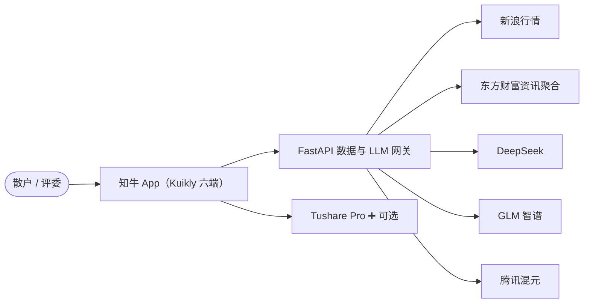
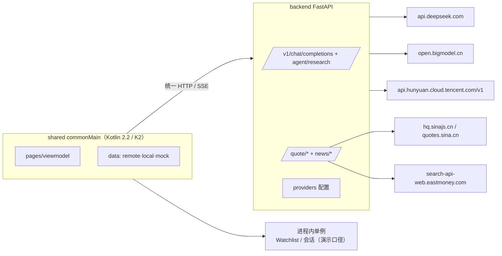

# 知牛 ZhiNiu · 架构说明（C4 + ADR）

> 版本：v0.1（2026-08-22）。图即代码（mermaid），随代码演进，不腐化。

---

## 1. C4 · 层级图

### L1 系统上下文

### L2 容器

### L3 shared 内部组件

见 `docs/tech-stack.md` §2 分层表（pages / viewmodel / domain / data / di）。

---

## 2. 架构决策记录（ADR）

> 模板：ADR-状态/背景/决策/后果。首批决策（aligned with 技术方案 §13.3）。

| 编号 | 决策 | 状态 |
|:--|:--|:--|
| ADR-001 | 选 Kuikly 而非 Flutter/RN（生产案例+鸿蒙支持） | ✅ |
| ADR-002 | 行情主源选新浪（免 Key+覆盖广） | ✅ |
| ADR-003 | LLM 经自建 FastAPI 网关、OpenAI 兼容协议多厂商可选（DeepSeek/GLM/混元），不可用时明确规则降级 | ✅（更新） |
| ADR-004 | K 线：统一 Kuikly Canvas 自绘（弃 Vico） | ✅（更新） |
| ADR-005 | 本地存储不引入 SQLDelight，演示口径用进程内单例（Watchlist/会话） | ✅（更新） |
| ADR-006 | 图标统一用 Tencent TDesign 官方资源，本地 PNG 预着色跨端渲染 | ✅ |
| ADR-007 | 行情与资讯只经后端数据源边界，结果带来源与 stale 语义 | ✅ |
| ADR-008 | 数字字体按 KuiklyUI 官方机制三端注册（Android IKRFontAdapter / iOS KRFontHandler / H5 @font-face），未注册端优雅降级 | ✅ |
| ADR-009 | AI 回复渲染：自研 commonMain Markdown 解析器（单测覆盖）+ 官方 RichText/Span，与结构化证据卡混排 | ✅ |

### ADR-003（更新）：LLM 经网关、多模型

- 背景：原方案客户端直连混元；但密钥安全 + 多模型切换 + 混元迁 TokenHub。
- 决策：加轻量 FastAPI 网关，统一 OpenAI 兼容协议；DeepSeek 作默认 quick、GLM 备选、混元可选。
- 后果：Key 只在服务端；客户端契约稳定；代价是多一层服务。

### ADR-004（更新）：Canvas 自绘 K 线

- 背景：Vico 为标准 Compose 库，与 Kuikly 非标准 Compose 集成未验证。
- 决策：统一 Kuikly Canvas 自绘；封装 `CandlestickChart` 组合组件。
- 后果：跨端一致、无渲染层冲突；需自实现坐标/缩放/十字游标。

---

## 参考
