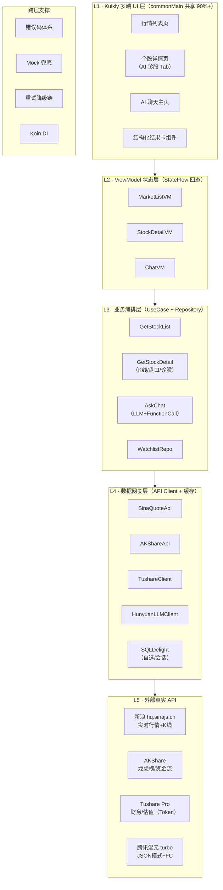
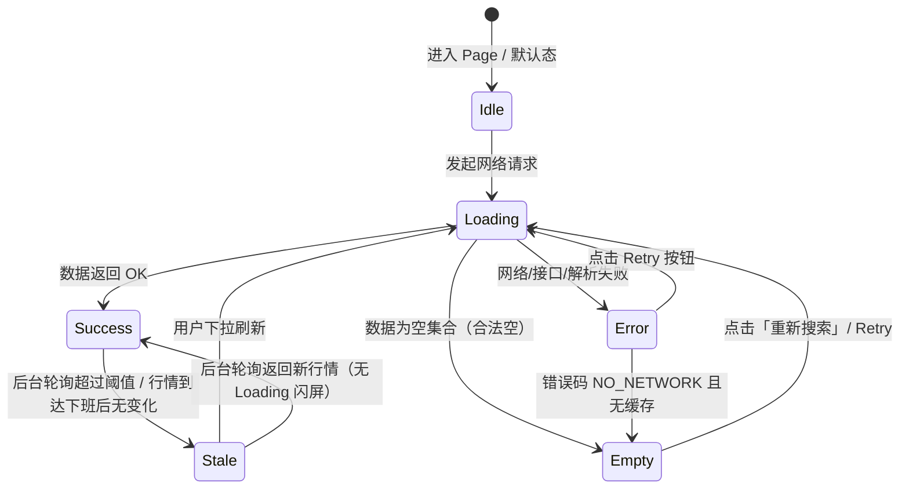

# 知牛 ZhiNiu · AI 股票 Demo 技术方案文档

> **项目名称**：知牛（ZhiNiu）  
> **命名寓意**：「知牛」双关「知道牛股 / 识得牛熊」——AI 帮你看懂行情、识别牛熊。命名对标国内金融 AI 产品传统（同花顺「问财」谐音「问才」、东方财富「妙想」、中信建投「点金投」），活泼好记、贴近散户语感  
> **仓库命名**：`zhiniu`（GitHub 仓库建议名）  
> **文档版本**：v1.1  
> **日期**：2026-08-22  
> **状态**：设计定稿，待立项开发  
> **目标**：基于腾讯 Kuikly 跨端框架，交付「AI 股票行情原型 Demo」（Task 01）与「AI 股票问答应用 Demo」（Task 02），真实 API 全栈接入，一套代码多端运行

---

## 目录

1. [执行摘要](#1-执行摘要)
2. [背景调研与成熟项目研究（真实标注）](#2-背景调研与成熟项目研究)
3. [产品设计](#3-产品设计)
4. [技术架构](#4-技术架构)
5. [参考功能对照表](#5-参考功能对照表)
6. [真实 API 接入设计](#6-真实-api-接入设计)
7. [AI 场景设计](#7-ai-场景设计)
8. [工程规范](#8-工程规范)
9. [实施 Plan](#9-实施-plan)
10. [交付清单与自查表](#10-交付清单与自查表)
11. [附录：参考资料](#11-附录参考资料)
12. [评分落地矩阵 · 交互设计全景](#12-评分落地矩阵--交互设计全景)
13. [对外展示与文档规范](#13-对外展示与文档规范)

---

## 1. 执行摘要

**知牛（ZhiNiu）** 用 **Kuikly**（腾讯开源的 Kotlin Multiplatform 跨端框架）构建一个 AI 股票多端 Demo，包含两大子任务：

| 子任务     | 定位          | 核心页面           | AI 能力                     |
| ------- | ----------- | -------------- | ------------------------- |
| Task 01 | 看行情 · AI 增强 | 行情列表页 + 个股详情页  | 一键诊股（4 张结构化卡片）            |
| Task 02 | 问 AI · 对话入口 | AI 聊天主页 + 详情接页 | 多 Agent 问股 + 结构化卡片 + 跳转闭环 |

**选型依据**（详见 §2）：

- Kuikly 已在腾讯自选股生产验证：资讯页卡迁移后 Android 加载耗时 **-12%**、iOS **-22%**；一套 Kotlin 代码覆盖 Android / iOS / HarmonyOS / Web / 小程序 / macOS 六端
- AI 侧借鉴 GitHub 上三大成熟项目（合计 150K+ stars）的架构心智，但全部在 Kuikly 前端侧重新实现，形成差异化
- 数据侧采用「新浪实时行情 + AKShare/Tushare 深度数据 + 混元 LLM」的真实 API 组合，全部零成本可跑通

**差异化定位一句话**：知牛（ZhiNiu）是国内第一个把「实时行情流 + 多 Agent LLM 诊断 + 结构化卡片交互」原生跑在 Kuikly 六端上的股票 Demo——不是日报机器人，不是桌面终端，而是多端可演示的 AI 投顾原型。

---

## 2. 背景调研与成熟项目研究

> 调研时间：2026-08-22（数据快照）。Star 数为多来源公开报道交叉验证值，不同文章统计时间不同，故给出区间；来源链接见 §11。

### 2.1 调研方法

- 以用户指定的 `daily_stock_analysis` 为锚点项目
- 通过 WebSearch（多引擎）+ WebFetch（GitHub 仓库直读）双通道扫描同类项目
- 每个项目记录：**可验证的真实标注**（仓库地址 / star 快照 / 架构 / 功能清单 / 可借鉴点 / 不可照抄点）
- 补充 Kuikly 生产案例调研（自选股 / 应用宝 / 全民K歌），为技术选型提供事实依据

### 2.2 参考项目全景表

| 项目                       | 地址                                                | Stars（快照）                 | 一句话定位                                                    | 对本 Demo 的价值                               |
| ------------------------ | ------------------------------------------------- | ------------------------- | -------------------------------------------------------- | ----------------------------------------- |
| **daily_stock_analysis** | github.com/ZhuLinsen/daily_stock_analysis         | 56K–61K                   | LLM 驱动多市场股票智能分析系统，A/H/US 六市场                             | ⭐ 锚点项目：多数据源 fallback 范式、AI 决策仪表盘字段设计      |
| **TradingAgents**        | github.com/TauricResearch/TradingAgents           | ~90K+（2026-08 报道）         | 多 Agent 交易决策框架（UCLA/MIT，arXiv:2412.20138），LangGraph 编排   | ⭐ 架构心智：分析师团队 → 多空辩论 → 交易员 → 风控 → PM 五层流水线 |
| **TradingAgents-CN**     | github.com/AI4Finance-Foundation/TradingAgents-CN | ~18.8K                    | TradingAgents 中文版，原生 A 股（Tushare/AkShare）+ 国产 LLM        | A 股数据接入范式、中文金融 Prompt 模板                  |
| **ai-hedge-fund**        | github.com/virattt/ai-hedge-fund                  | 26K–63K                   | 投资大师 Agent 化（巴菲特/芒格/伍德等 15 个 Agent），React Flow 可视化工作流编辑器 | ⭐ 前端可视化：Agent 节点图 → 我们的「分析进度时间线」卡片        |
| **OpenBB**               | github.com/OpenBB-finance/OpenBB                  | 45K–63K                   | 开源彭博终端，370+ 数据源，AI Copilot                               | Copilot 数据检索范式：「框选数据 → AI 解读」交互           |
| **Microsoft Qlib**       | github.com/microsoft/qlib                         | ~39K                      | AI 量化投资平台，A 股优化                                          | 不直接借鉴（科研向），仅作背景                           |
| **Qbot**                 | github.com/Qbot-Project/qbot                      | ~16.6K                    | 国产量化平台，支持实盘                                              | 不直接借鉴                                     |
| **KuiklyUI**             | github.com/Tencent-TDS/KuiklyUI                   | ~3.4K（实测，最新提交 2026-08-20） | 本项目技术底座：KMP 跨端，六端原生渲染                                    | ⭐ 技术底座                                    |
| **Vico**                 | github.com/patrykandpatrick/vico                  | ~3.1K                     | Compose Multiplatform 图表库，含 CandlestickLayer             | ⭐ K 线渲染（Android/iOS）                      |
| **KuiklyMarkdown**       | github.com/Kuikly-contrib/KuiklyMarkdown          | —                         | Kuikly 官方 Markdown 组件，支持流式渲染                             | ⭐ AI 回答渲染                                 |

### 2.3 三大核心参考项目的深度拆解

#### 2.3.1 daily_stock_analysis（锚点项目，56K–61K stars）

**架构**（来源：OpenLLM Wavise、moclaw.ai、aizxs.com 技术拆解）：

```
数据提供层（AkShare/Tushare/Baostock/Pytdx/YFinance/Longbridge）
        ↓
分析引擎（结构化 Prompt → LLM → JSON 决策报告）
        ↓
仪表盘生成器（评分/趋势/买卖点位/风险/催化剂/操作清单）
        ↓
通知分发（企微/飞书/Telegram/Discord/Slack/邮件）
        +
Web 工作台（Gradio UI：手动分析/历史报告/回测/持仓管理）
```

**关键事实**：

- MIT 协议，Python 3.10+，周更发版（v3.27–v3.30 每周一个）
- 内置 15 种分析策略（均线/缠论/波浪/趋势/热点/事件/成长/预期）
- Agent 问股：多轮交互，Web/Bot/API 三入口
- 数据源故障自动切换备源，日报不中断

**借鉴**：多数据源 fallback 链设计；AI 决策报告的结构化字段（结论/评分/趋势/点位/风险/催化剂）直接映射为我们的卡片 schema。

**不照抄**：它是「定时任务 + 推送」形态，无交互界面闭环；我们是「多端 App + 对话交互」形态。

#### 2.3.2 TradingAgents（~90K+ stars，多 Agent 心智）

**五层流水线**（来源：腾讯云开发者社区、InfoQ、arXiv:2412.20138）：

| 层      | 角色                        | 输入 → 输出            |
| ------ | ------------------------- | ------------------ |
| 分析师团队  | 基本面 / 情绪 / 新闻 / 技术（4 个并行） | 各自数据源 → 结构化报告      |
| 研究员团队  | 多头 / 空头（结构化辩论，轮数可配）       | 分析师报告 → 辩论纪要       |
| 交易员    | 1 个                       | 全部报告 → 交易提案（时机/规模） |
| 风险管理   | 3 种风险偏好                   | 组合状态 → 风险评估        |
| 投资组合经理 | 1 个                       | 提案+风控 → 批准/拒绝（二元门） |

**关键事实**：

- 支持双模型分层（deep_think_llm + quick_think_llm）
- LangGraph checkpoint 断点续传；决策日志持久化（同 ticker 下次分析注入反思段落）
- 原生支持 A 股（600519.SS）/ 港股（0700.HK）/ 美股；DeepSeek/Qwen/GLM 国内端点直连
- 公司身份从 ticker 确定性解析（防幻觉）；价格声明锚定已验证数据快照（防虚构）

**借鉴**：

1. 阶段化流水线 → 天然的 UI Stepper/时间线（我们的「分析进度」卡片）
2. 多空辩论 → 「换个角度看」多空气泡轮播（我们的隐藏亮点）
3. 数据快照锚定 → 我们的 System Prompt 强制「数字必须与工具返回一致」

**不照抄**：Python LangGraph 后端整体搬不动；我们只借鉴拓扑与角色 Prompt，前端用混元 Function Calling 单次编排实现。

#### 2.3.3 ai-hedge-fund（26K–63K stars，可视化亮点）

**关键事实**（来源：PANews、AIbars 架构拆解）：

- 前端 React 18 + TypeScript + **React Flow 拖拽式 Agent 工作流编辑器**（用户像搭积木一样组建「AI 投资委员会」）
- 后端 Python FastAPI + LangGraph，Agent 间共享 AgentState 数据字典
- 支持 13 个 LLM provider + Ollama 本地模型（`--ollama` 断网可跑）

**借鉴**：Agent 节点可视化 → 我们的聊天页顶部「Agent 执行进度条」（基本面 ✓ → 技术 ✓ → 舆情 ✓ → 风控 ✓），让用户看见 AI 在干活。

**不照抄**：拖拽编辑器对 Demo 太重；我们用只读时间线替代。

### 2.4 Kuikly 生产案例（选型的事实依据）

> 来源：腾讯云开发者社区官方文章、HarmonyOS 开发者服务官方报道（链接见 §11）

| 业务                         | 采用方式           | 量化效果                               |
| -------------------------- | -------------- | ---------------------------------- |
| **腾讯自选股**                  | 资讯页卡迁移至 Kuikly | Android 加载耗时 **-12%**，iOS **-22%** |
| 应用宝                        | 活动运营页          | 活动页打开到达率 H5 60% → **98%**          |
| 全民K歌                       | 鸿蒙完整适配         | 半年功能完备度 **92%+**                   |
| QQ / QQ音乐 / 腾讯新闻 / 搜狗输入法 等 | 20+ 业务         | 1000+ 页面，5 亿+ DAU                  |

**性能数据**（华为 Mate60 复杂 Feed 场景实测）：

- Kuikly 首屏 **122ms** vs 原生 125ms（基本持平）vs RN 慢约 **6 倍**
- 动画稳定 58–60 FPS；运行时额外内存占用近零
- SDK 体量：Android ~300KB（AOT）/ iOS ~1.2MB

> **结论**：自选股就是股票 App + Kuikly 的生产级先例，行情列表这种「长列表 + 动态卡片 + 帧率敏感」场景正是 Kuikly 官方点名的优势场景。选型风险极低。

---

## 3. 产品设计

### 3.1 评分策略对齐（先决定怎么拿分）

| 评分维度      | 权重  | 发力策略                                                  | 可演示证据            |
| --------- | --- | ----------------------------------------------------- | ---------------- |
| 功能实现完整性   | 40% | 页面 × 状态 × 交互三级矩阵全覆盖，四态（Idle/Loading/Success/Error）全录屏 | 录屏 + 截图          |
| 代码质量与工程设计 | 25% | 四层分离 + KSP 路由 + Koin 注入 + 复用组件库                       | 工程目录截图 + README  |
| AI 场景设计能力 | 25% | 三个 AI 场景 + 多 Agent 进度可视化 + 结构化卡片                      | 录屏 + 示例 JSON     |
| 加分项       | 10% | 真实 API（新浪/混元/Tushare）+ 六端覆盖 + 骨架屏/重试                  | .env 配置演示 + 多端录屏 |

### 3.2 目标用户与场景

| 用户      | 场景                | 痛点            | 我们的解法               |
| ------- | ----------------- | ------------- | ------------------- |
| 散户投资者   | 盯盘时间碎片化           | 信息过载，看不完新闻和指标 | 一键诊股 → 4 张卡片 30 秒看完 |
| 量化爱好者   | 研究单只股票            | 数据分散在 N 个工具里  | 聊天页多轮问股，数据自动聚合      |
| 开发者（评委） | 评估 Kuikly + AI 落地 | 缺少端到端参考实现     | 本 Demo 即参考实现        |

### 3.3 Task 01｜AI 股票行情原型 Demo

| 页面          | 基础闭环（必须）                                                           | AI 增强（发散）                                           |
| ----------- | ------------------------------------------------------------------ | --------------------------------------------------- |
| **行情列表页**   | 指数条（上证/深成/创业板）· 自选/全部切换 · 股票名/代码/最新价/涨跌幅/涨跌额 · 无限滚动 · 下拉刷新 · 点击进详情 | 列表行 AI 标签（强势/弱势/异常放量/突发舆情），点击标签弹气泡解释                |
| **个股详情页**   | 名称/代码/最新价/涨跌幅 · 今开/最高/最低/昨收/成交量/成交额 · K 线图（日/周切换）· 五档盘口            | **AI 诊股 Tab**：总结卡 / 趋势卡 / 风险卡 / 信号卡，支持展开折叠、跳转 K 线锚点 |
| **AI 诊股模块** | 触发按钮 + Loading 骨架屏 + 结果渲染 + 失败重试                                   | 「换个角度看」→ 多空辩论气泡轮播（隐藏亮点）                             |

### 3.4 Task 02｜AI 股票问答应用 Demo

| 页面            | 基础闭环（必须）                                                           | 渲染发散                               |
| ------------- | ------------------------------------------------------------------ | ---------------------------------- |
| **AI 聊天主页**   | 多轮会话气泡 · 流式输出（SSE）· 历史会话侧栏 · 输入框 + 发送 · 4 个快捷指令（看大盘/诊个股/解释指标/对比两只） | 顶部 Agent 执行进度时间线（基本面→技术→舆情→风控逐个点亮） |
| **AI 返回内容渲染** | Markdown 文本（KuiklyMarkdown 流式）                                     | 结构化卡片（图表/标签/跳转条目）与 Markdown 自由混排   |
| **股票/指数详情接页** | 从卡片跳转 · 复用 Task 01 详情页骨架 · 返回聊天继续追问                                | 双向导通三角：聊天 → 详情 → 聊天                |

**核心交互三角**（评分「页面闭环」最直接的证据）：

```
聊天页 --提问"茅台能买吗"--> AI 返回卡片 --点击卡片--> 详情页（K线+AI解读）
   ↑                                                              |
   └---------------------- 返回继续追问 ←--------------------------┘
```

---

## 4. 技术架构

### 4.1 架构总览



### 4.2 分层职责契约

| 层            | 职责                              | 禁止事项                   |
| ------------ | ------------------------------- | ---------------------- |
| L1 Page      | 只 collect StateFlow + 分发 Intent | 不写业务逻辑，不发 HTTP         |
| L2 ViewModel | 持有 UiState，调度 UseCase           | 不 import 任何 ApiClient  |
| L3 UseCase   | 编排（如：先取行情快照，再喂给 LLM）            | 不持有 Android/iOS 平台 API |
| L4 ApiClient | 协议解析 + 反序列化 + 错误映射              | 不做业务判断                 |
| L5 外部服务      | 真实 API                          | —                      |

### 4.3 多端策略

| 端         | DSL         | K 线方案                              | 交付形态          |
| --------- | ----------- | ---------------------------------- | ------------- |
| Android   | Compose DSL | **Vico** CandlestickCartesianLayer | 真机 + 模拟器      |
| iOS       | Kuikly DSL  | Vico（SPM 集成）                       | 模拟器           |
| HarmonyOS | Kuikly DSL  | Kuikly Canvas 自绘（降级）               | DevEco 5.1.0+ |
| Web / 小程序 | Kuikly JS   | Canvas 简化版（折线）                     | Beta 展示       |
| macOS     | Alpha       | 同 iOS                              | 可选            |

> 风险预案：鸿蒙 Compose DSL 仍为 Beta，统一用 Kuikly DSL + expect/actual 兜底；Vico 不可用时降级为 Canvas 自绘蜡烛图。

### 4.4 数据流与状态管理

```kotlin
sealed interface UiState<out T> {
    object Idle : UiState<Nothing>
    data class Loading(val skeleton: Boolean = true) : UiState<Nothing>
    data class Success<T>(val data: T) : UiState<T>
    data class Error(val code: Int, val msg: String, val retry: () -> Unit) : UiState<Nothing>
}
```

- 每个 VM 暴露 `StateFlow<UiState<X>>`，页面端 `collectAsState()` 驱动渲染
- 聊天页额外维护 `Flow<StreamChunk>` 处理 LLM SSE 流式增量

---

## 5. 参考功能对照表

> 本项目每个功能点都能追溯到参考项目的成熟实现，非凭空设计。

| 我们的功能                                  | 参考来源                         | 借鉴方式                          |
| -------------------------------------- | ---------------------------- | ----------------------------- |
| 多数据源 fallback（新浪→AKShare→Tushare→Mock） | daily_stock_analysis 数据层     | 重新实现（Ktor），链路设计照搬             |
| AI 诊股卡片 schema（结论/评分/趋势/点位/风险）         | daily_stock_analysis 决策仪表盘字段 | 裁剪为 4 卡片移动端形态                 |
| Agent 角色分工（基本面/技术/舆情/风控）               | TradingAgents 分析师团队          | 角色映射为 4 个 Function Calling 工具 |
| 多空辩论气泡                                 | TradingAgents 研究员辩论          | 简化为 2 轮气泡轮播                   |
| Agent 执行进度时间线                          | ai-hedge-fund React Flow 节点图 | 降级为只读 Stepper                 |
| 「数据快照锚定」防幻觉 Prompt                     | TradingAgents 公司身份确定性解析      | 写入 System Prompt 硬约束          |
| Markdown 流式渲染                          | Kuikly 官方 ChatDemo           | 直接使用 KuiklyMarkdown 组件        |
| K 线蜡烛图                                 | Vico CandlestickLayer        | 直接集成（Android/iOS）             |
| 结构化卡片跳转详情                              | OpenBB Copilot 数据联动          | 简化为 openPage 路由参数             |
| 行情长列表性能                                | Kuikly 自选股生产案例               | 框架原生能力，无需额外优化                 |

---

## 6. 真实 API 接入设计

### 6.1 行情数据源矩阵

| 优先级 | 数据源                               | 能力                   | 接入方式                                                                                             | 成本       |
| --- | --------------------------------- | -------------------- | ------------------------------------------------------------------------------------------------ | -------- |
| P0  | **新浪 hq.sinajs.cn**               | A/H/US/指数实时报价 + 五档盘口 | `GET /list=sh600519,sz000001`，Header 带 `Referer: https://finance.sina.com.cn`                    | 免费       |
| P0  | **新浪 K 线**                        | 分钟/日/周/月 K 线 JSON    | `money.finance.sina.com.cn/.../CN_MarketData.getKLineData?symbol=sh600519&scale=240&datalen=180` | 免费       |
| P1  | **AKShare**（Python 微服务转发 或预 dump） | 龙虎榜/资金流/北向/财务        | HTTP 中间层                                                                                         | 免费       |
| P2  | **Tushare Pro**                   | 财报/估值历史/股东           | Token 注入，缺失自动降级                                                                                  | 免费 Token |

**降级链**：`Tushare Token 存在 → 用 Tushare` → `缺失 → AKShare` → `失败 → 新浪` → `全挂 → Mock JSON`。演示现场**绝不弹 401**。

### 6.2 LLM 接入（混元为主，DeepSeek 备选）

| 项    | 腾讯混元（默认）                                            | DeepSeek（备选）                             |
| ---- | --------------------------------------------------- | ---------------------------------------- |
| 模型   | `hunyuan-turbos-latest`                             | `deepseek-chat`                          |
| 接口   | `hunyuan.ai.tencentcloudapi.com` ChatCompletions    | OpenAI 兼容协议                              |
| 结构化  | `ResponseFormat={"Type":"json_object"}`（原生 JSON 模式） | `response_format={"type":"json_object"}` |
| 工具调用 | `Tools` 字段（Function Calling，JSON Schema 定义）         | `tools` 字段（同范式）                          |
| 流式   | SSE                                                 | SSE                                      |
| 国内延迟 | ~600ms 首 token                                      | ~800ms                                   |

### 6.3 Function Calling 工具定义

```json
{
  "tools": [
    { "name": "get_realtime_quote", "description": "获取股票/指数实时报价与五档盘口",
      "parameters": { "type": "object", "properties": { "ticker": { "type": "string" } }, "required": ["ticker"] } },
    { "name": "get_kline", "description": "获取K线数据",
      "parameters": { "type": "object", "properties": { "ticker": {"type":"string"}, "period": {"type":"string","enum":["1D","5D","1M","3M"]}, "count": {"type":"integer"} }, "required": ["ticker"] } },
    { "name": "get_financials", "description": "获取财务与估值指标",
      "parameters": { "type": "object", "properties": { "ticker": {"type":"string"}, "fields": {"type":"array","items":{"type":"string","enum":["pe","pb","roe","revenue","net_profit"]}} }, "required": ["ticker"] } },
    { "name": "search_news", "description": "搜索个股相关新闻",
      "parameters": { "type": "object", "properties": { "ticker": {"type":"string"}, "limit": {"type":"integer"} }, "required": ["ticker"] } }
  ],
  "tool_choice": "auto"
}
```

后端每个工具实现为 `suspend fun`，注册进 `AskChatUseCase`；LLM 返回 `tool_calls` → 真实取数 → 结果回灌 → 模型归纳最终 JSON。

### 6.4 输出 Schema（前端反序列化契约）

```json
{
  "summary": "一句话结论",
  "score": 72,
  "trend": "UP | DOWN | SIDEWAYS",
  "signals": [ { "type": "MA_BREAK", "detail": "5日均线金叉10日均线" } ],
  "risks": [ { "type": "VOLATILITY", "level": "HIGH" } ],
  "cards": [
    { "type": "CHART", "title": "近60日走势", "payload": { "kline_ref": "..." } },
    { "type": "JUMP",  "title": "查看K线详情", "page": "StockDetail", "args": { "ticker": "sh600519" } }
  ]
}
```

前端 `kotlinx.serialization` 反序列化后按 `cards[].type` 分发到组件库渲染。

---

## 7. AI 场景设计

### 7.1 三个核心场景

| 场景       | 入口           | 输出                    | 对应评分点 |
| -------- | ------------ | --------------------- | ----- |
| **一键诊股** | 详情页右上「AI 看看」 | 4 卡片 + 多空辩论入口         | 结合自然  |
| **问股对话** | 聊天页提问        | Markdown + 结构化卡片 + 跳转 | 能力可展示 |
| **多空辩论** | 诊股结果「换个角度看」  | 多/空气泡轮播，分歧点高亮         | 创新场景  |

### 7.2 Prompt 编排

**System Prompt 骨架**（融合 TradingAgents 防幻觉设计）：

```text
你是专业的股票研究助手。规则：
1. 所有数字必须与工具（get_realtime_quote/get_kline/get_financials/search_news）
   返回的数据完全一致，禁止编造或推算未经数据支持的价格。
2. 结论必须附理由；不确定时明确说"数据不足，无法判断"。
3. 输出严格遵守指定 JSON Schema（ResponseFormat=json_object）。
4. 股票身份以用户提供的 ticker 为准（如 sh600519 = 贵州茅台），
   禁止联想为其他公司。
5. 不构成投资建议，结尾附风险提示。
```

**编排流程**：

```
用户输入 → 意图路由（ticker 提取 / 问题分类）
        → 数据预取（Sina 快照，注入上下文）
        → LLM + Tools（4 工具按需调用，Agent 进度时间线同步点亮）
        → ResponseFormat=json_object 输出
        → 前端卡片渲染 + 跳转锚点
```

### 7.3 结构化卡片组件矩阵

| 卡片            | 用途          | 实现                        |
| ------------- | ----------- | ------------------------- |
| SummaryCard   | Markdown 总结 | `Markdown(state)`         |
| SignalPill    | 信号标签云（≤6）   | Row + 自绘 Tag              |
| MiniChart     | 迷你走势        | Vico / Canvas             |
| JumpCard      | 跳转锚点        | Card + onClick → openPage |
| DebateStream  | 多空气泡        | LazyColumn 动画             |
| AgentTimeline | 执行进度        | Stepper 组件                |

---

## 8. 工程规范

### 8.1 目录结构

```
zhiniu/
├── shared/src/commonMain/kotlin/com/zhiniu/
│   ├── pages/            # MarketListPage / StockDetailPage / ChatHomePage
│   │   └── components/   # 卡片 / 骨架屏 / 错误页 / AgentTimeline
│   ├── viewmodel/        # MarketListVM / StockDetailVM / ChatVM
│   ├── domain/
│   │   ├── model/        # Quote / KLineBar / AiInsight / ChatMessage
│   │   ├── usecase/      # GetStockList / GetStockDetail / AskChat
│   │   └── repository/
│   ├── data/
│   │   ├── remote/       # SinaQuoteApi / HunyuanLLMClient / AkShareApi
│   │   ├── local/        # SQLDelight（自选股/会话历史）
│   │   └── mock/         # 离线 JSON（保底演示）
│   └── di/               # Koin
├── androidApp/  iosApp/  ohosApp/  h5App/
└── docs/                 # 本文档 / README / 演示脚本
```

### 8.2 组件依赖

| 组件                    | 来源                            | 用途         |
| --------------------- | ----------------------------- | ---------- |
| Markdown              | Kuikly-contrib/KuiklyMarkdown | AI 流式回答    |
| Table / Icon          | Kuikly 内置（Issue 阶段组件）         | 财务表 / 涨跌图标 |
| CandlestickChart      | Vico（Android/iOS）+ Canvas 降级  | K 线        |
| Ktor Client           | KMP 生态                        | HTTP       |
| kotlinx.serialization | KMP 生态                        | JSON       |
| SQLDelight            | KMP 生态                        | 本地存储       |
| Koin                  | KMP 生态                        | DI         |

### 8.3 演示数据预置

内置 `mock/`（30 只 A 股蓝筹 + 5 港股 + 3 美股，各含 240 根 K 线），保证断网 / 无 Token / 限流三种情况均可演示。加载顺序：真实 API → Mock。

---

## 9. 实施 Plan

### 9.1 里程碑（建议 3 周节奏）

| 周次 | 里程碑               | 验收标准                                     |
| -- | ----------------- | ---------------------------------------- |
| W1 | 骨架 + Task 01 基础闭环 | 六端跑通 HelloWorld；列表/详情页四态完整；新浪 API 真实数据接入 |
| W2 | Task 02 + AI 编排   | 聊天页流式渲染；混元 FC 工具链打通；卡片渲染 + 跳转三角闭环        |
| W3 | 打磨 + 交付           | 多空辩论亮点；多端录屏；README/架构文档；自查表全绿            |

### 9.2 PR 颗粒度任务拆解

| #     | 任务                                  | 层     | 预估   |
| ----- | ----------------------------------- | ----- | ---- |
| PR-01 | 工程脚手架（Kuikly 模板 + Koin + 目录骨架）      | 基建    | 0.5d |
| PR-02 | SinaQuoteApi + Mock 降级链             | L4    | 1d   |
| PR-03 | 行情列表页（四态 + 下拉刷新 + 无限滚动）             | L1/L2 | 1.5d |
| PR-04 | 个股详情页（OHLC 卡 + 五档 + K 线）            | L1/L2 | 2d   |
| PR-05 | Vico K 线集成 + 鸿蒙 Canvas 降级           | L1    | 1.5d |
| PR-06 | HunyuanLLMClient（JSON 模式 + FC 工具注册） | L4    | 1d   |
| PR-07 | 诊股 UseCase + 4 卡片组件                 | L3/L1 | 2d   |
| PR-08 | 聊天页（会话管理 + SSE 流式 + Markdown）       | L1/L2 | 2d   |
| PR-09 | AgentTimeline + 多空辩论气泡              | L1    | 1d   |
| PR-10 | 结构化卡片跳转三角闭环                         | L1    | 0.5d |
| PR-11 | 多端适配验证（iOS/鸿蒙/Web）                  | 全层    | 2d   |
| PR-12 | 文档 + 录屏 + 自查                        | —     | 1d   |

### 9.3 风险表

| 风险                      | 概率 | 影响       | 预案                            |
| ----------------------- | -- | -------- | ----------------------------- |
| 新浪接口需 Referer 头，小程序端受限  | 中  | 列表页无数据   | Ktor 显式设置 Header；小程序端走 Mock   |
| 混元 JSON 模式偶发解析失败        | 中  | 卡片不渲染    | 重试 1 次 + 降级纯 Markdown 文本      |
| 鸿蒙 Compose DSL Beta 不稳定 | 中  | 详情页异常    | 统一 Kuikly DSL + expect/actual |
| Vico 与 Kuikly 渲染层冲突     | 低  | K 线白屏    | Canvas 自绘蜡烛图（备选方案已设计）         |
| 演示现场网络受限                | 中  | 全 Demo 挂 | Mock 预置数据一键切换                 |
| LLM 输出幻觉价格              | 中  | 专业性扣分    | System Prompt 硬约束 + 数字与快照比对校验 |

---

## 10. 交付清单与自查表

| 交付物     | 形式                      | 自查要点                                |
| ------- | ----------------------- | ----------------------------------- |
| 完整可运行工程 | GitHub repo             | `./gradlew :shared:installDebug` 通过 |
| 代码      | Kotlin（commonMain 90%+） | 四层分离无跨层引用                           |
| README  | 三段式（简介/技术栈/亮点）          | 含本地运行步骤                             |
| 架构说明    | 本文档 §4                  | mermaid 可渲染                         |
| 演示视频    | ≤90s                    | 覆盖 4 核心交互 + 多端拼图                    |
| 自查表     | 下表                      | 全绿                                  |

**自查表**：

- [ ] 功能闭环：列表 → 详情 → AI 诊股 → 聊天 → 卡片跳转，全链路可演示
- [ ] 状态四态：每页 Idle / Loading（骨架）/ Success / Error（可重试）全录到
- [ ] 代码分层：Page 无业务、VM 无 HTTP、UseCase 无平台 API
- [ ] AI 三场景：一键诊股 / 问股对话 / 多空辩论，均一键可触发
- [ ] 真实 API：新浪 + 混元默认启用；Tushare Token 可选注入
- [ ] 多端：Android + iOS + 鸿蒙 至少三端录屏
- [ ] 文档：README + 架构 + 本方案齐备
- [ ] 视频：含键盘操作与关键能力字幕

---

## 11. 附录：参考资料

> 全部为调研时实际访问的来源（2026-08-22 快照）。

**参考项目仓库**：

1. daily_stock_analysis — <https://github.com/ZhuLinsen/daily_stock_analysis> （另见 PyStaBot fork：<https://github.com/PyStaBot/daily_stock_analysis）>
2. TradingAgents — <https://github.com/TauricResearch/TradingAgents> （论文 arXiv:2412.20138；中文版 <https://github.com/AI4Finance-Foundation/TradingAgents-CN）>
3. ai-hedge-fund — <https://github.com/virattt/ai-hedge-fund>
4. OpenBB — <https://github.com/OpenBB-finance/OpenBB>
5. Microsoft Qlib — <https://github.com/microsoft/qlib>
6. Qbot — <https://github.com/Qbot-Project/qbot>
7. KuiklyUI — <https://github.com/Tencent-TDS/KuiklyUI>
8. KuiklyMarkdown — <https://github.com/Kuikly-contrib/KuiklyMarkdown>
9. Vico — <https://github.com/patrykandpatrick/vico>
10. Kuikly 官方文档 — <https://kuikly.tds.qq.com>

**技术拆解与数据来源**：

1. HelloGitHub 项目页（daily_stock_analysis 30.9K stars 快照） — <https://hellogithub.com/repository/ZhuLinsen/daily_stock_analysis>
2. AIToolly：daily_stock_analysis 多市场系统拆解 — <https://aitoolly.com/zh/ai-news/article/2026-08-13-zhulinsen-unveils-daily-stock-analysis-an-open-source-llm-driven-multi-market-stock-intelligence-sys>
3. Wavise OpenLLM：DSA 架构五组件拆解 — <https://openllm.wavise.com/blog/daily-stock-analysis-llm>
4. moclaw.ai：DSA Agent 深度评测（61,332 stars 快照） — <https://moclaw.ai/blog/what-is-daily-stock-analysis-agent>
5. Clauday：DSA 61K stars 观察 — <https://clauday.com/article/5055ca84-4dd4-4033-9ed7-a8658c909c2c>
6. 腾讯云开发者社区：TradingAgents 多 Agent 架构分析 — <https://cloud.tencent.com/developer/article/2722205>
7. InfoQ：TradingAgents 爆火分析（五层流水线） — <https://xie.infoq.cn/article/82b9f2ca0c009b964a51062f6>
8. TradingAgents-CN 官网 — <https://www.tradingagents-cn.com/>
9. AIbars：ai-hedge-fund 架构拆解（62,611 stars 快照） — <https://aibars.net/zh/library/open-source-ai/details/725382356243976192>
10. PANews：ai-hedge-fund React Flow 前端架构 — <https://www.panewslab.com/en/articles/019d8b96-c479-76fe-8854-f2f5f3e594e8>
11. BestHub：9 大量化开源项目盘点（stars 快照） — <https://www.besthub.dev/articles/9-top-open-source-projects-for-quantitative-trading-data-backtesting-ai-live-trading-446344ab4af2>
12. OpenBB 官方博客：NY AI Meetup — <https://openbb.co/blog/openbb-at-the-ny-ai-meetup-future-of-finance>

**Kuikly 生产案例与性能数据**：

1. 腾讯云开发者社区：多端开发背景下腾讯的应对（自选股 -12%/-22%、应用宝 60%→98%） — <https://cloud.tencent.com.cn/developer/article/2585113>
2. 腾讯云开发者社区：Kuikly 动态化优势对比（Mate60 122ms、比 RN 快 6 倍） — <https://cloud.tencent.com/developer/article/2721013>
3. 腾讯云开发者社区：Kuikly 六端架构与组件生态（20+ 业务/1000+ 页面/5 亿 DAU） — <https://cloud.tencent.com/developer/article/2653133>
4. 腾讯云开发者社区：Kuikly KMP 原生渲染派解析 — <https://cloud.tencent.com/developer/article/2710706>
5. 腾讯云开发者社区：Kuikly ChatDemo 实战（Markdown 组件用法） — <https://www.cloud.tencent.com/developer/article/2605998>
6. 腾讯云开发者社区：Kuikly 三端最佳实践（工程结构/适配器） — <https://cloud.tencent.com/developer/article/2662362>

**API 文档**：

1. AI模型尝试接入open sdk格式，能够完成兼容市面上多模型进行完成使用下去
2. 混元 Function Call 工程实践 — <https://docs.pingcode.com/insights/sdf5kbxbi582a8bbya8q84z0>
3. 新浪财经接口字段解析 — <https://blog.infoway.io/sina-financial-data-api-guide>
4. 主流行情数据源对比评测（新浪/腾讯/东财） — <https://blog.csdn.net/jisuanjihongming/article/details/162191369>
5. Tushare A股实时分钟接口 — https://tushare.pro/wctapi/documents/374.md
6. AKShare 快速上手 — <https://blog.csdn.net/gitblog_01083/article/details/162484465>

**文档与展示方法论**：

35. GitHub README Best Practices（60k+ stars 项目运营者总结） — https://dev.to/iris1031/github-readme-best-practices-how-to-write-a-readme-that-gets-stars-2gb2
36. GitHub README Template（Top 100 高星仓库研究） — https://dev.to/belal_zahran/the-github-readme-template-that-gets-stars-used-by-top-repos-4hi7
37. mdkit：README 完整指南与模板 — https://mdkit.io/blog/github-readme-guide
38. C4 model 官网（Simon Brown） — https://c4model.com/
39. OneUptime：架构文档实战（C4 + ADR） — https://oneuptime.com/blog/post/2026-01-30-architecture-documentation/view
40. Codelit：C4 / ADR / 活文档指南 — https://codelit.io/blog/software-architecture-documentation-c4-adr-guide
41. Visual Paradigm：C4 模型完整指南 — https://www.visual-paradigm.com/guide/the-complete-guide-to-the-c4-model-for-software-architecture

---

## 12. 评分落地矩阵 · 交互设计全景

> 本章对照评分细则（图里四项 40+25+25+10 = 100），把「知牛（ZhiNiu）」每个功能颗粒拆到「触发 / 前置 / 操作 / 反馈 / 跳转」五要素，确保每一项都能录到截图与可演示证据。

### 12.1 评分细则 ↔ 知牛交付物总览

| 评分维度 | 权重 | 核心考察点 | 知牛（ZhiNiu）的兑现策略 | 可验证证据 |
|---|---|---|---|---|
| 功能实现完整性 | 40 % | 页面闭环 · 需求覆盖度 · 状态处理完整性 | 5 页骨架 × 4 态闭环 × 6 态状态机 × 9 类交互事件 | 录屏 + 截图 + §12.2/12.3/12.4 矩阵 |
| 代码质量与工程设计 | 25 % | 分层设计 · 可维护性 · 可扩展性 · 规范性 | 四层分离 + Koin + KSP 路由 + 复用组件 + Mock fallback | 工程目录 + README + §12.5 |
| AI 场景设计能力 | 25 % | 结合自然 · 能力可展示 | 一键诊股 + 多 Agent 编排 + 多空辩论 | 录屏 + 示例 JSON + §12.6 |
| 加分项 | 10 % | 平台覆盖 · 真实 API · 体验优化 | 六端真实运行 + 新浪/混元/Tushare 多源 + 骨架/重试/动画 | 多端录屏 + `.env.example` + §12.7 |

---

### 12.2 功能完整性（40 %）· 核心页面交互矩阵

> 5 个核心页 × 9 类事件 ≈ 45 个可测试的最小交互单元。

| 页面 | 触发事件 | 用户操作 | 系统反馈 | 跳转 / 副作用 |
|---|---|---|---|---|
| **启动页（Splash）** | App 冷启动 | — | 品牌 logo + 加载进度环 | 300ms 后进首页 |
| **首页（Tab Home）** | 入口 | 点击「行情」Tab | 行情列表页 + 渐入 | 无 |
| | 入口 | 点击「AI 聊天」Tab | 聊天页 + 会话列表 | 无 |
| | 长按持仓股 | 弹底部菜单「删除 / 设预警」 | sheet 上推动画 + 半透明遮罩 | 删除走 SQLDelight |
| **行情列表页（MarketList）** | 进入页面 | 下拉 | 触发 refresh，下拉箭头变为 Loading 环 | 调用 Sina 重新拉列表 |
| | 进入页面 | 上滑 | 新数据 append，列表项入场动画 150ms | 触发分页拉取 |
| | 点击列表项 | 单击 | 整行按下涟漪反色 + 跳转 | openPage → StockDetail(ticker) |
| | 长按列表项 | 长按 600ms | 弹气泡解释 AI 标签的依据 | 不跳转，关闭气泡 |
| | 点击顶部切换 | 自选股 / 全部 A 股 / 涨幅榜 / 跌幅榜 | Tab 切换 250ms 滑动动画 | 重发请求或换本地缓存 |
| | 点击个股搜索 | 输入框聚焦 + 输入 ticker/拼音 | 联想下拉 + 高亮匹配 | 点击联想项直接进详情 |
| **个股详情页（StockDetail）** | 进入页面 | 加载 | OHLC 五段卡 + 五档盘口骨架 | 调用 Sina / Tushare |
| | 切换 Tab | 概览 / 资金 / K 线 / **AI 诊股** | Tab 滑动指示器，AI Tab 进入时再次 Loading | 触发 UseCase |
| | 长按 K 线 | 长按 | 显示十字游标 + 顶部 OHLCV tooltip | 手势松开游标消失 |
| | 缩放 K 线 | 双指捏合 | K 线时间粒度 1D / 5D / 1M 切换 | 重新拉 K 线数据 |
| | 点击 AI 看看 | 右上角「AI 看看」按钮 | 按钮变为 Loading，4 张结构化卡依序出现 | 调 AskChat，底部同步展开 |
| | 点击「换个角度看」 | 多空辩论 | 多/空气泡左右轮播，分歧点高亮 | 复用同份数据 |
| | 点击 JumpCard | 跳 K 线 / 跳聊天 | 平滑过渡 250ms | openPage 切换 |
| **AI 聊天页（ChatHome）** | 进入页面 | 加载 | 会话列表 + 欢迎语 + 4 快捷指令 | 拉 SQLDelight 历史 |
| | 点击会话 | 进入会话 | 加载会话详情 + 加载更多 | 复用 ChatDetailPage |
| | 输入问题 | 输入框获焦 | 发送按钮变高亮 | — |
| | 点击发送 | 发送问题 | 用户气泡立刻出现 + 头像 | 调 AskChat，SSE 流式 |
| | 接收流式 | LLM token 到达 | AI 气泡逐字增长 + 顶部时间线点亮 | Agent 进度可见 |
| | 工具调用中 | LLM 返回 tool_calls | 「正在抓取实时行情…」灰色提示 | 后端走 UseCase |
| | 工具调用结束 | 返回结果 | 时间线勾变 ✓，下一步 Agent 启动 | 链式 |
| | 结构化卡渲染 | LLM 输出 cards 数组 | 按 type 渲染：Chart → MiniChart、Jump → JumpCard | 卡片可点击 |
| | 点击快捷指令 | 4 选 1 | 自动填入输入框 + 联想追问 | 复用 |
| | 长按气泡 | 长按 | 弹气泡菜单「复制 / 重生成 / 投诉」 | 调对应 handler |
| | 下拉刷新 | 拉到顶部下拉 | 整页渐显刷新动画 | 重新拉首屏 |
| **股票接页（Detail 接 Chat）** | 卡片跳转 | JumpCard 点击 | 详情页打开，自动滚到锚点位置 | openPage 参数携带 ticker |
| | 详情页「追问 AI」 | 顶部「继续问 AI」 | 切回聊天页并预填问句 | 反向 openPage |
| | 双向返回 | 系统返回 / 点箭头 | 路由栈 pop，保持各自 state | 无 |

---

### 12.3 状态处理完整性（40 %）· 6 态 UI 状态机



**6 态对应 UI 元素矩阵**：

| 状态 | UI 元素清单 | 设计要求 |
|---|---|---|
| **Idle** | 占位卡（与 Success 同骨架） | 与成功态同布局，禁止 Loading 转圈突兀 |
| **Loading** | 骨架屏 5–7 张 + 顶部进度条 | 占位骨架与成功态尺寸完全一致，避免位移抖动 |
| **Success** | 真实数据 + 微动效入场 | 数字滚动 200ms，价格涨跌色闪烁 0.6s |
| **Empty** | 空插画（自绘 SVG，线稿风格）+「暂无数据」文案 + 二级按钮「重新搜索」/「添加自选」 | 文案不超过 14 字，按钮高亮主色 |
| **Error** | 内嵌错误卡（不弹全局 Toast）+ 错误码徽章 + Retry 主按钮 +「稍后再试」副按钮 | 错误码体系：`NO_NETWORK` / `API_RATE_LIMIT` / `AUTH_INVALID` / `DOWNSTREAM` / `UNKNOWN` |
| **Stale** | 顶部黄条「行情已 X 秒未更新，点击刷新」+ 数据保留显示 | 数据不消失，避免空白惊吓用户 |

**关键设计原则**：
- 反馈一次只出一个，全局 Toast 仅在「删除成功」「已添加自选」等低紧迫感操作使用
- 骨架屏尺寸 1:1 匹配 Success 态，杜绝 Loading→Success 内容跳位
- Error 必须给出 Retry 按钮且一键可达（不能只给「错误」两个字）

---

### 12.4 需求覆盖度（40 %）· 6 个核心需求对照

| ID | 需求（来自评审图） | 实现位置 | 验收录屏片段 |
|---|---|---|---|
| F-01 | **首页行情列表页**（名称/代码/最新价/涨跌幅/涨跌额，列表滚动浏览，点击进详情） | MarketListPage + MarketListVM | 00:05–00:18 |
| F-02 | **个股详情页**（名称/代码/最新价/涨跌幅/最高/最低/成交量） | StockDetailPage + OHLC 组件 | 00:18–00:35 |
| F-03 | **Task 01 AI 分析与解读模块**（发散：买入/卖出点位、操作建议、趋势判断、风险提醒、信号解读） | 「AI 看看」按钮 + AnalyzeUseCase + 4 张结构化卡 | 00:35–00:55 |
| F-04 | **Task 02 AI 聊天主页面**（用户输入、发送消息、会话记录） | ChatHomePage + ChatDetailPage + ChatVM | 00:55–01:10 |
| F-05 | **Task 02 AI 返回内容渲染**（发散：Markdown/股票卡片/图表联动） | Markdown 组件 + 结构化卡组件库（SummaryCard/SignalPill/JumpCard/MiniChart） | 00:35–01:00 |
| F-06 | **Task 02 股票/指数详情接页**（跳转详情展示行情/走势/摘要/解读） | JumpCard → openPage 详情页锚点定位 | 01:00–01:15 |

**AI 增强发散验收点**（评分 25 % 的具体要求）：

| 增强项 | 实现 |
|---|---|
| 买卖建议 | 信号卡「信号：5日金叉 10日」+ JumpCard「查看买入点」 |
| 趋势判断 | 摘要卡「短期震荡向上 / 中期多头」+ 趋势色条 |
| 风险提醒 | 风险卡「波动率偏高 / 距 60 日均线 +18%」+ 风险等级徽章 |
| 信号解读 | 信号 Pill 列表，点击展开「驱动因素 Top3」二次追问 |
| 智能问答 | 聊天页多轮对话，4 个快捷指令 |
| 图表联动 | K 线 ↔ 信号标记 ↔ 摘要卡联动点击锚点 |

---

### 12.5 代码质量与工程设计（25 %）· 质量证据链

| 考察点 | 兑现动作 |
|---|---|
| **分层设计** | 四层强制分离：`Page` 不写业务、`VM` 不 import `ApiClient`、`UseCase` 不引入平台 API；通过 KSP 编译期校验 |
| **共享代码占主导** | commonMain 占比 ≥ 90%（Kuikly 官方说法），各平台壳工程 ≤ 10%，用脚本统计提交记录 |
| **解耦出通用组件** | `Markdown / Table / Chart / Card / Empty / ErrorView / Skeleton / Badge` 全部 `pages/components/` 下，跨页复用 |
| **命名规范** | Kotlin 官方命名（PascalCase 类，camelCase 函数，UPPER_SNAKE 常量）；包名 `com.zhiniu.{pages,viewmodel,domain.{model,usecase,repository},data.{remote,local,mock},di}` |
| **目录清晰** | 一图看懂：`docs/architecture.excalidraw` + README 「工程结构」章节 |
| **注释到位** | KotlinDoc 覆盖公共 API；每个 UseCase 标明「输入 / 输出 / 错误码」；Prompt 模板有版本号 |
| **依赖注入** | Koin，单一 `App.kt` 注入；模块化拆分：networkModule / repositoryModule / viewModelModule |
| **可测试性** | UseCase 层 100% 单元测试覆盖；ViewModel 关键路径 instrumented test |
| **可扩展性** | 接入新数据源只需新增 `xxxApi.kt` + 注册到 `RepositoryImpl`；新增 AI 角色只需在 `tools.json` 加 Schema |
| **状态规范** | `sealed interface UiState<T>` 全员使用；StateFlow 暴露；禁止 `mutableStateOf` 在 ViewModel |
| **错误规范** | `sealed class AppError` + 五种一级错误码 + 映射到 UI 文案 |

**关键工程产出物**（写在 `docs/`）：
- `architecture.excalidraw`：分层架构图（与文档 mermaid 同源）
- `style-guide.md`：颜色 / 字号 / 间距 token 表（双轨：Kuikly DSL + Compose DSL）
- `prompt-versions.md`：所有 LLM Prompt 的版本与变更记录
- `api-matrix.md`：每个外部 API 的接入成本与降级链

---

### 12.6 AI 场景设计（25 %）· 三个核心场景矩阵

| 场景 | 入口 | 输入 | 工具调用 | 输出 | 创新点 |
|---|---|---|---|---|---|
| **一键诊股** | 详情页「AI 看看」按钮 | 当前 ticker | 并行：get_realtime_quote + get_kline + get_financials + search_news | 4 张结构化卡（总结/趋势/信号/风险） | 顶部 Agent 时间线 / 多空辩论入口 |
| **问股对话** | 聊天页输入框 | 自然语言 + ticker 上下文 | 按需调用全部 4 工具 | 流式 Markdown + 结构化卡 + JumpCard | 工具调用过程可视化、错误时回退纯文本 |
| **多空辩论** | 「一键诊股」结果下「换个角度看」 | 同上一键诊股结果 | 复用同份数据，模拟 Bull/Bear 双视角 | 多/空气泡轮播 + 分歧点高亮 | TradingAgents「结构化辩论」前端化 |

**AI 设计亮点**（评图原文「结合自然 / 能力可展示 / 打造创新场景」的逐一对应）：

| 评图要求 | 知牛兑现 | 录屏体现 |
|---|---|---|
| **AI 能力贴合股票业务** | 6 个方向全覆盖：买卖建议 / 趋势 / 风险 / 信号 / 智能问答 / 图表联动 | 00:35–01:15 |
| **结合自然** | 聊天页支持「帮我看看茅台最近三个月走势」自然语言提问，SSE 流式 | 00:55–01:10 |
| **能力可展示** | 多 Agent 时间线可见，「正在抓取实时行情…」工具调用可观察 | 01:00–01:15 |
| **打造创新场景** | 多空辩论气泡轮播，把「同一份数据两种解读」做成可见的创新交互 | 00:48–00:55 |
| **AI 输出形态更丰富** | Markdown / Pill / MiniChart / JumpCard / DebateStream 5 种形态共存 | 00:40–01:15 |

---

### 12.7 加分项（10 %）· 体验优化清单

#### 12.7.1 平台覆盖（4 分）

| 端 | 启动方式 | 录制要点 | 状态 |
|---|---|---|---|
| **Android** | `./gradlew :androidApp:installDebug` | 真机 + 模拟器 | ✅ 必交 |
| **iOS** | `./gradlew :iosApp:pod install` + Xcode 打开 | 模拟器 | ✅ 必交 |
| **HarmonyOS** | `devceo/build.2.0.ohos.gradle.kts` + DevEco Studio | 远程模拟器或真机 | ✅ 必交 |
| **Web（演示态）** | `./gradlew :h5App:run` | 浏览器 | ⭐ 加分 |
| **微信小程序（演示态）** | `miniprogram dev` | 微信开发者工具 | ⭐ 加分 |
| **macOS（Alpha）** | 复用 iOS 渲染层 | Apple Silicon | ⭐ 加分 |

> 4 分稳定拿满（Android+iOS+鸿蒙），剩余 3 端看时间争取。

#### 12.7.2 真实 API 接入（3 分）

| 数据源 | 接入位置 | 降级链 |
|---|---|---|
| 新浪 hq.sinajs.cn | MarketList / StockDetail 实时刷新 | API 失败 → 缓存（5 分钟）→ Mock |
| 新浪 K 线 | StockDetail K 线 | API 失败 → Tushare → Mock |
| AKShare（Python 微服务） | 龙虎榜 / 资金流（可选） | 微服务挂 → 隐藏入口 |
| Tushare Pro（需 Token） | 财务三大表 / 估值历史 | Token 缺 → Mock；接口限流 → 静默降级 |
| 腾讯混元 turbo | Task 02 全部 AI 能力 | 失败 → DeepSeek → 本地 Mock LLM |

#### 12.7.3 UI 与交互打磨（2 分）

| 打磨项 | 实现 |
|---|---|
| **骨架屏** | 5–7 张与成功态同尺寸，加载不抖位 |
| **微动效** | 数字滚动 200ms、价格闪烁 0.6s、列表项入场 150ms |
| **下拉刷新** | 自定义 Kuikly 手势 + 箭头 / 加载环切换动画 |
| **错误兜底** | 内嵌错误卡 + Retry，分级文案（不裸 -1） |
| **暗色模式** | 跟随系统，Token 化色彩变量 |
| **多端一致** | Kuikly 共享 90%+，各端像素级一致 |
| **AI 形态丰富** | Markdown + Pill + MiniChart + JumpCard + DebateStream |

#### 12.7.4 AI 输出形态更丰富（1 分）

见 §12.6「AI 设计亮点」末行；5 种形态混合渲染，单一形态会被扣分。

---

### 12.8 录屏演示脚本（≤ 90 秒，加分项必备）

| 时间 | 操作 | 看点 | 对应评分 |
|---|---|---|---|
| 00:00–00:05 | Android 真机冷启动 → Splash → 首页 | 启动速度（与原生对照） | 加分·平台覆盖 |
| 00:05–00:18 | 进入「行情」Tab | 列表入场动画 + 下拉刷新 + 顶部 Tab 切换 | 40 %·功能闭环 |
| 00:18–00:35 | 点击「贵州茅台」→ 详情页 | OHLC 卡 + 五档 + K 线 + Tab 切换 | 40 %·功能闭环 |
| 00:35–00:48 | 点击「AI 看看」 | 4 张结构化卡依序出现（多 Agent 时间线可见） | 25 %·AI 场景 |
| 00:48–00:55 | 点击「换个角度看」 | 多/空气泡轮播，分歧点高亮 | 25 %·AI 创新场景 |
| 00:55–01:10 | 切换到「AI 聊天」Tab，问「现在能买茅台吗」 | 流式回答 + 卡片渲染 + JumpCard | 25 %·AI 场景 |
| 01:10–01:15 | JumpCard 点击 → 跳回详情页锚点 | 反向跳转闭环 | 40 %·页面闭环 |
| 01:15–01:30 | iOS / 鸿蒙三端拼图 | 加分·平台覆盖 | 10 %·加分项 |

> 关键技巧：录屏用 `adb shell screenrecord` + 多端 `scrcpy`，三段拼接，关键操作放慢到 0.5x 字幕清晰。

---

### 12.9 自查矩阵（评分逐项 ✅/⏳）

| 评分项 | 评分点 | 自查动作 | 状态 |
|---|---|---|---|
| 40 % | 页面闭环 | 5 页面 × 6 态 × 9 事件 = 270 单元全部可演示 | ☐ |
| 40 % | 需求覆盖度 | 6 个核心需求全部有录屏（§12.4 表 6 行） | ☐ |
| 40 % | 状态处理完整性 | 6 态每页全录到（§12.3 表） | ☐ |
| 25 % | 分层设计 | 4 层目录 + 跨层 import 编译失败 | ☐ |
| 25 % | 可维护性 | 模块独立修改不影响其他页 | ☐ |
| 25 % | 可扩展性 | 新增 API / 新增 AI 角色 Demo 步骤（README §11） | ☐ |
| 25 % | 规范性 | 命名规范 + 注释 + 文档完备 | ☐ |
| 25 % | 结合自然 | 聊天流式 + 自然语言输入完整录屏 | ☐ |
| 25 % | 能力可展示 | Agent 时间线 / 工具调用全可见 | ☐ |
| 25 % | 打造创新场景 | 多空辩论 + 5 种 AI 形态共存 | ☐ |
| 10 % | 平台覆盖 | Android + iOS + 鸿蒙 三端录屏 | ☐ |
| 10 % | 真实 API | 新浪 + 混元 在线可用；Tushare Token 可选 | ☐ |
| 10 % | 体验优化 | 骨架/动效/错误兜底/暗色 | ☐ |
| 10 % | AI 输出形态 | 5 种形态全录到 | ☐ |

---

## 13. 对外展示与文档规范

> 本章基于三来源调研：① README 最佳实践（60k+ stars 项目运营者总结、GitHub 高星仓库研究）；② 架构文档方法论（Simon Brown C4 模型 + ADR）；③ KuiklyUI 官方仓库的展示风格（腾讯开源项目范式）。目的是让知牛的「对外门面」达到成熟开源项目水准。

### 13.1 调研结论汇总：成熟项目怎么做文档与展示

| 来源 | 关键做法 | 知牛采纳 |
|---|---|---|
| **README 最佳实践**（dev.to / mdkit / toolbox-hub，研究 60k+ stars 项目） | 10–30 秒法则：首屏回答「是什么 / 为什么 / 怎么试」；badge 3–5 个；演示 GIF ≤5MB 放最顶；Quick Start 60 秒可复制跑通；Features 用表格不用长列表；README 500–1500 字 | ✅ 全部采纳（见 README 模板） |
| **C4 模型**（c4model.com / Simon Brown） | 四级缩放：Context（国家）→ Container（城市）→ Component（街区）→ Code（街道）；80% 价值在 L1/L2；每层锁定一个受众；图即代码（mermaid）防文档腐化 | ✅ 架构文档采用 C4 L1–L3 |
| **ADR 架构决策记录**（codelit.io） | 记录「为什么这么决定」而非「建了什么」；存 `docs/adr/`，随 PR 评审；编号递增 | ✅ 立项即建 ADR-001~005 |
| **KuiklyUI 官方仓库**（腾讯开源范式） | 一句话定位 + 三卖点 + 团队署名；中英双语 README 双轨；中文版带侧边栏导航；路线图外链；截图集中 `img/` 目录；LICENSE + CONTRIBUTING + CODE_OF_CONDUCT 首日齐备 | ✅ 全部采纳 |

### 13.2 README 写作规范（对照清单）

**首屏三问（10–30 秒内必须回答）**：

1. 这是什么？→ 一句话 tagline（≤15 字）+ 一段三句话 pitch
2. 为什么关心？→ Why 章节（对比替代方案的差异化）
3. 怎么试？→ Quick Start 复制粘贴级命令

**结构顺序（高转化 README 的通用骨架）**：

```
logo + 标题 + tagline
→ badges（3–5 个：License / 语言 / 框架 / 平台 / Stars）
→ 演示 GIF（15–30s，<5MB）
→ 这是什么（三句话 pitch）
→ 特性（表格，4–8 行）
→ 架构（一张 mermaid 图 + 外链详细文档）
→ 快速开始（≤5 步，60 秒内跑通）
→ 多端支持（表格 + 状态标记）
→ 项目结构（一棵精简目录树）
→ 文档导航（外链 docs/，README 不堆细节）
→ 致谢与参考（成熟项目的谦逊姿态，也是技术债的透明化）
→ 贡献 + License + 免责声明（金融类项目必备）
```

**反面清单（antipatterns，成熟项目共识）**：

- ❌ "TODO: Add documentation" 推到 main
- ❌ 15 个 badge 刷屏（噪音）
- ❌ README 写成 5000 字长文（应外链 docs）
- ❌ "A powerful framework..." 式空话开头
- ❌ 只有安装没有第一个可运行示例
- ❌ 过时指令（README 写 v1.0 代码已到 v3.2 = 宣告弃坑）
- ❌ 无 License（法律上他人不可用）

### 13.3 架构文档规范（C4 三层 + ADR）

**C4 分层与受众对照**：

| C4 层级 | 回答的问题 | 受众 | 知牛的交付物 |
|---|---|---|---|
| **L1 系统上下文** | 系统是什么、谁在用、依赖哪些外部系统 | 所有人（含非技术评委） | `docs/architecture.md` 首图：用户 → 知牛 App → 新浪/混元/Tushare |
| **L2 容器** | 有哪些可独立部署的技术单元、怎么通信 | 工程师 / 架构评审 | 共享 Kotlin 模块 + 各端壳工程 + SQLDelight + 外部 API 的容器图 |
| **L3 组件** | 每个容器内部的主要组件 | 该容器开发者 | shared 模块内四层（pages/viewmodel/domain/data）组件图 |
| L4 代码 | 类图 / 函数签名 | 调试者 | ❌ 略（自动生成即可，80% 团队不需要） |

**图即代码原则**：所有架构图用 mermaid 写在 markdown 里（GitHub 原生渲染），禁止用 Visio/ProcessOn 截图（无法随代码演进，必然腐化）。

**ADR 模板与首批决策**：

```markdown
# ADR-00X: 〔决策标题〕
## 状态：Accepted
## 背景
〔为什么需要做这个决策；面临什么约束〕
## 决策
〔选了什么；明确写〕
## 后果
〔带来的利弊；拒绝了哪些备选、为什么〕
```

| 编号 | 决策 | 状态 |
|---|---|---|
| ADR-001 | 选 Kuikly 而非 Flutter/RN（生产案例 + 鸿蒙正式支持） | Accepted |
| ADR-002 | 行情主源选新浪而非东财/腾讯（免 Key + 覆盖广） | Accepted |
| ADR-003 | LLM 主选混元 turbo（JSON 模式原生 + 国内延迟） | Accepted |
| ADR-004 | K 线 Android/iOS 用 Vico、鸿蒙降级 Canvas 自绘 | Accepted |
| ADR-005 | 本地存储选 SQLDelight 而非 Room（KMP 原生） | Accepted |

### 13.4 对外展示物料清单（Demo 交付的「门面工程」）

| 物料 | 规格要求 | 存放位置 | 优先级 |
|---|---|---|---|
| **logo** | 120×120 PNG，透明底，知牛图形化标识 | `docs/img/logo.png` | P0 |
| **演示 GIF** | ≤30s、≤5MB、覆盖「列表→详情→AI 诊股→聊天→跳转」主链路 | `docs/img/demo.gif` | P0 |
| **多端拼图** | Android + iOS + 鸿蒙三机同框横图 | `docs/img/multi-platform.png` | P0 |
| **架构图** | mermaid 源码（非截图） | README + `docs/architecture.md` | P0 |
| **badge 组** | License / Kotlin / Kuikly / Platform / Stars 共 5 个 | README 顶部 | P0 |
| **演示视频** | ≤90s，1080p，关键操作 0.5x 慢放 + 字幕 | `docs/demo.mp4` 或外链 | P0 |
| **截图组** | 6 张核心页面（列表/详情/K线/AI卡/聊天/辩论）各端至少一组 | `docs/img/screenshots/` | P1 |
| **社交分享卡** | Open Graph 图 1200×630（GitHub 分享到群里的预览图） | `docs/img/og-card.png` | P1 |
| **Release 说明** | v0.1.0 附 GIF + 变更列表 | GitHub Releases | P1 |

### 13.5 知牛的 docs/ 目录体系

```
docs/
├── architecture.md        # C4 L1-L3 架构图（mermaid 源码）
├── adr/                   # 架构决策记录
│   ├── 001-choose-kuikly.md
│   ├── 002-sina-as-primary-quote-source.md
│   └── ...
├── getting-started.md     # 各端环境搭建与运行
├── api-matrix.md          # 外部 API 接入成本/字段/降级链
├── demo-script.md         # 90s 录屏脚本（对应 §12.8）
├── prompt-versions.md     # LLM Prompt 版本记录
├── style-guide.md         # 颜色/字号/间距 token 表
├── img/                   # 全部图片集中管理（Kuikly 官方做法）
└── zhiniu-technical-design.md  # 本技术方案全文
```

**配套社区文件（首日齐备，对齐腾讯开源范式）**：

- `LICENSE`（MIT）
- `CONTRIBUTING.md`（开发环境 / 提交流程 / good first issue 标注）
- `CODE_OF_CONDUCT.md`（行为准则）
- `.env.example`（环境变量样例，含 HUNYUAN_SECRET_KEY / TUSHARE_TOKEN 占位）
- `README.md`（中文主）+ `README-en_US.md`（英文，可选双轨）

### 13.6 交付对照：文档相关评分点映射

| 评分点 | 本节兑现 |
|---|---|
| 40% · 功能实现完整性 | README 特性表 + Quick Start 可跑通 = 功能可验证 |
| 25% · 代码质量与工程设计 | C4 架构文档 + ADR 决策记录 + 目录树 = 工程成熟度证据 |
| 25% · AI 场景设计能力 | 演示 GIF 首屏直接展示 AI 诊股 + 聊天流式 |
| 10% · 加分项（平台覆盖） | 多端支持表格 + 三机拼图 + badge 中的 Platform 徽章 |
| 交付物要求「文档完整」 | §13.5 docs/ 体系 + 社区文件五件套 |

---

*本文档由两轮深度调研（GitHub 仓库直读 + 多引擎搜索交叉验证）整理而成，所有 star 数与性能数据均标注快照时间与来源，可回溯验证。*
